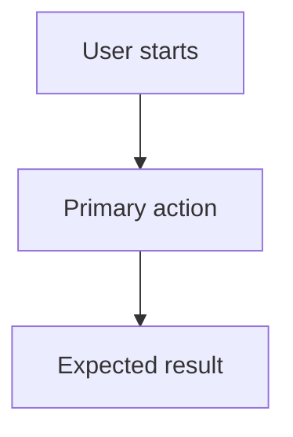

# <Project Name> Requirements

## Document Status

- Project slug:
- Owner:
- Created:
- Last updated:
- Status: Draft | User Reviewed | Approved

## Project Summary

Describe the project in one short paragraph.

## Project Goals

- Goal 1:
- Goal 2:
- Goal 3:

## Target Users

| User Role | Needs | Pain Points | Success Outcome |
| --- | --- | --- | --- |
|  |  |  |  |

## Core Features

| Feature | Priority | Description | Acceptance Criteria |
| --- | --- | --- | --- |
|  | Must |  |  |

## Detailed Requirements

### Functional Requirements

- FR-001:
- FR-002:

### Non-Functional Requirements

- Performance:
- Security:
- Privacy:
- Accessibility:
- Compatibility:
- Reliability:

## User Flows

## Scope

### In Scope

- 

### Out Of Scope

- 

## Constraints

- Technical:
- Business:
- Timeline:
- Budget:
- Legal/compliance:

## Risks

| Risk | Impact | Likelihood | Mitigation |
| --- | --- | --- | --- |
|  |  |  |  |

## Open Questions

- [ ] Question:

## Approval

- User approved: Yes | No
- Approval date:
- Notes:
