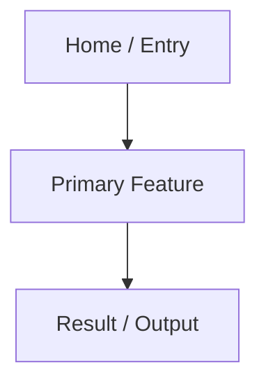
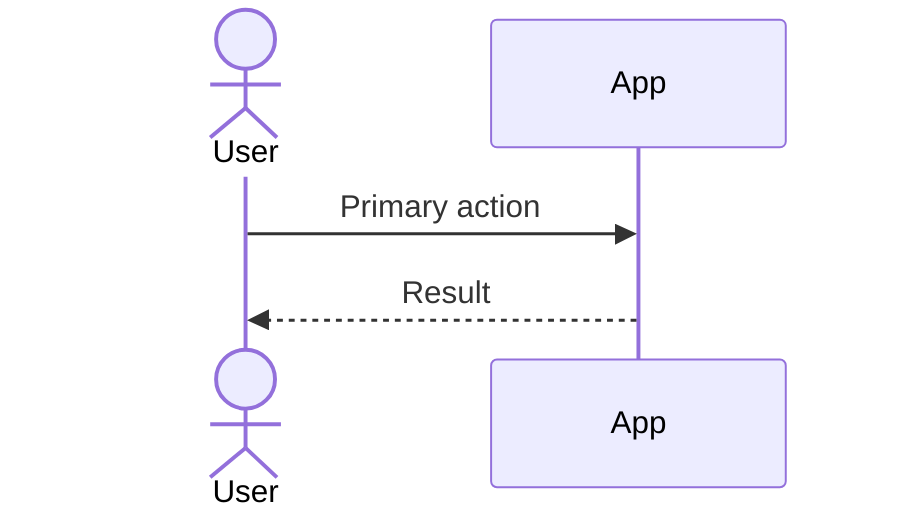

# <Project Name> Design Specification

## Document Status

- Project slug:
- Based on requirements:
- Created:
- Last updated:
- Status: Draft | User Reviewed | Approved

## Design Goals

- 

## Product Structure

## Information Architecture

- Navigation:
- Main sections:
- Key content objects:
- Permission-specific views:

## Screen And Page List

| Screen/Page | Purpose | Primary Users | Key States |
| --- | --- | --- | --- |
|  |  |  | Loading, empty, error, success |

## Interaction Flows

## Visual Direction

- Style:
- Color system:
- Typography:
- Iconography:
- Layout density:
- Motion:

## Component Guidelines

| Component | Usage | States | Notes |
| --- | --- | --- | --- |
|  |  |  |  |

## Responsive Strategy

- Mobile:
- Tablet:
- Desktop:
- Wide desktop:

## Accessibility Requirements

- Keyboard:
- Screen reader:
- Contrast:
- Focus states:
- Reduced motion:

## Design Artifacts

Add links, screenshots, Mermaid diagrams, Figma references, or generated visuals here.

- Figma:
- Screenshots:
- Diagrams:

## Design Review Checklist

- [ ] Covers all approved requirements.
- [ ] Covers loading, empty, error, disabled, and success states.
- [ ] Covers responsive behavior.
- [ ] Covers accessibility requirements.
- [ ] User approved design direction.

## Approval

- User approved: Yes | No
- Approval date:
- Notes:
