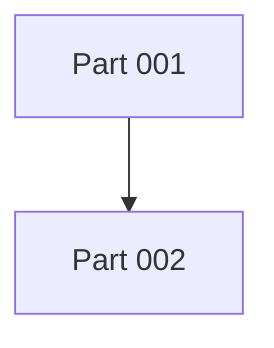

# <Project Name> Development Plan

## Document Status

- Project slug:
- Based on requirements: `00-requirements.md`
- Based on design: `01-design-spec.md`
- Created:
- Last updated:
- Status: Draft | User Reviewed | Approved

## Technical Overview

- Stack:
- Architecture:
- Key dependencies:
- Environments:
- Deployment target:

## Development Principles

- Follow `AGENTS.md`.
- Read requirements, design specification, development plan, and current Part document before coding.
- Keep Part ownership clear and avoid shared write conflicts.
- Record verification evidence for every completed Part.

## Part Breakdown

| Part | Name | Owner Role | Dependencies | Parallelizable | Status |
| --- | --- | --- | --- | --- | --- |
| 001 |  | `implementation-engineer` | None | Yes | Planned |

## Dependency Graph

## Integration Plan

- Integration order:
- Shared contracts:
- Merge strategy:
- Conflict risks:

## Test And Verification Strategy

- Unit tests:
- Integration tests:
- E2E/browser tests:
- Security checks:
- Manual acceptance:

## Release Strategy

- Deployment target:
- Config/secrets:
- Rollback:
- Monitoring:

## Open Risks

| Risk | Owner | Mitigation |
| --- | --- | --- |
|  |  |  |

## Approval

- User approved: Yes | No
- Approval date:
- Notes:
