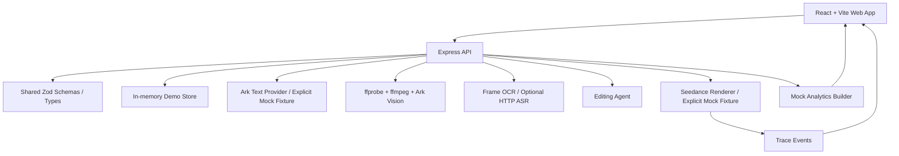

# ShopClip AI 🎬

ShopClip AI 是一个面向电商商家的 AIGC 带货短视频生成 Demo 工作台。它把商品 brief、结构化素材信息和创意风格转成可编辑的脚本、分镜、渲染 trace、预览/导出产物和效果看板。

本仓库也是一个带 Agent 项目管理规则的全栈演示工作区：根目录 `AGENTS.md` 和 `.agents/` 定义了项目经理、产品文档、架构规划、实现、质量安全、交付运维等协作规则，方便后续 Agent 接手真实软件项目开发。

## 当前状态 ✅

- P0 主链路已完成：创建项目、上传素材并结构化、生成脚本/分镜、编辑分镜、渲染 trace、预览和导出。
- P1 能力已完成：素材标签/检索、分镜编辑与局部重生成、Editing Agent 建议、TTS/字幕/BGM 设置、失败渲染重试、mock 数据看板。
- 多颗粒度素材结构化已接入真实媒体处理：视频会通过 ffprobe 获取时长/分辨率，通过 ffmpeg 抽取真实关键帧；字幕/贴纸/商品标签等视频文字默认由视觉模型 OCR 识别。ASR 仅作为显式配置的可选增强。
- 业务 provider 不再默认静默 mock：脚本、视觉理解、参考拆解、公开视频下载、Seedance 渲染在未配置真实 provider 时会显式失败；只有显式设置 `mock` 才进入测试/演示 fixture。
- 已提供 Render 部署配置：`render.yaml`。
- 最新交付证据位于 `projects/shopclip-ai/evidence/`。
- 最终交接记录：`projects/shopclip-ai/evidence/final-handoff.md`。

## 技术栈 🧰

| 层级       | 技术                                         |
| ---------- | -------------------------------------------- |
| 前端       | React 19、Vite、TypeScript、lucide-react     |
| 后端       | Node.js、Express、TypeScript                 |
| 契约       | `packages/shared` 中的 Zod schema 和共享类型 |
| 测试       | Vitest、Playwright                           |
| 包管理     | pnpm via Corepack                            |
| 当前持久化 | 确定性 in-memory demo store                  |
| 生产规划   | PostgreSQL + Prisma                          |
| 部署       | Render Blueprint                             |

## 目录结构 📁

```text
apps/
  api/          Express API、生命周期接口、mock providers
  web/          React 工作台 UI 和 Playwright E2E
packages/
  shared/       Zod schemas、共享 TypeScript 类型、健康检查 payload
projects/
  shopclip-ai/  需求、设计、开发计划、Part 文档和验证证据
.agents/        Agent 团队工作流、skills、plugins、本地私有 memory
plugins/        项目级插件副本
render.yaml     Render Blueprint：API 服务 + Web 静态站点
report.md       最新任务汇报
```

## 本地启动 🚀

安装依赖：

```bash
corepack enable
corepack pnpm install
```

创建本地环境变量文件：

```bash
cp .env.example .env
```

PowerShell：

```powershell
Copy-Item .env.example .env
```

启动前后端：

```bash
corepack pnpm dev
```

默认地址：

- Web：`http://localhost:5173/#project`
- API health：`http://localhost:4000/health`

## 环境变量 🔐

| 变量                   | 使用方 | 是否必需             | 说明                                                       |
| ---------------------- | ------ | -------------------- | ---------------------------------------------------------- |
| `PORT`                 | API    | 本地可选             | Render 会自动注入。                                        |
| `CORS_ORIGIN`          | API    | 生产必需             | 逗号分隔的 Web 允许来源。                                  |
| `JSON_BODY_LIMIT`      | API    | 可选                 | 默认 `1mb`。                                               |
| `VITE_API_URL`         | Web    | 生产必需             | 公共 API base URL，例如 `https://<api>.onrender.com/api`。 |
| `DATABASE_URL`         | API    | 未来使用             | 当前 Demo 使用内存存储，后续接 PostgreSQL/Prisma。         |
| `AI_PROVIDER_MODE`     | API    | 业务必需             | 业务运行使用 `ark`/`doubao`/`real`；只有测试/演示 fixture 显式设置 `mock`。 |
| `ARK_API_KEY`          | API    | 真实 provider 才需要 | 火山方舟共享服务端密钥；三类 AI 模型默认共用它。             |
| `AI_GENERAL_API_KEY`   | API    | 可选                 | 通用/文案模型专用密钥；为空时回退使用 `ARK_API_KEY`。       |
| `REFERENCE_PROVIDER_MODE` | API | 参考拆解必需 | 业务运行使用 `ark`/`doubao`/`real`；缺 key/model 会报配置错误，不再静默 mock。 |
| `AI_REFERENCE_MODEL_ID` | API   | 真实参考拆解才需要   | 参考视频拆解模型的方舟 endpoint ID 或可调用 model ID；为空时可回退 `AI_GENERAL_MODEL_ID`。 |
| `AI_REFERENCE_API_KEY` | API    | 可选                 | 参考拆解专用密钥；为空时回退 `AI_GENERAL_API_KEY` 或 `ARK_API_KEY`。 |
| `REFERENCE_DOWNLOAD_PROVIDER_MODE` | API | 公公开视频主动下载必需 | 默认真实 HTTP 直链下载；只有显式 `mock` 才返回测试 fixture。平台短链通常需要后续接 `yt-dlp` 或托管下载服务。 |
| `REFERENCE_DOWNLOAD_MAX_BYTES` | API | 可选 | 公开视频下载大小上限，默认 `52428800`。 |
| `AI_IMAGE_API_KEY`     | API    | 图片生成可选         | 图片生成专用密钥；为空时回退使用 `ARK_API_KEY`。            |
| `VIDEO_RENDER_PROVIDER_MODE` | API | 渲染必需 | 业务运行使用 `seedance`/`ark`/`doubao`/`real`；只有显式 `mock` 才返回演示预览。 |
| `AI_VIDEO_API_KEY`     | API    | 视频生成可选         | 视频生成专用密钥；为空时回退使用 `ARK_API_KEY`。            |
| `AI_GENERAL_MODEL_ID`  | API    | 真实 provider 才需要 | 通用/文案模型的方舟 endpoint ID 或可调用 model ID。          |
| `VISION_PROVIDER_MODE` | API    | 素材理解必需          | 业务运行使用 `ark`/`doubao`/`real`；缺 key/model 或模型失败会报错，不再生成假结构化结果。 |
| `AI_VISION_MODEL_ID`   | API    | 真实素材理解才需要    | 图片/视频理解模型的方舟 endpoint ID 或可调用 model ID。       |
| `AI_VISION_API_KEY`    | API    | 可选                 | 视觉理解专用密钥；为空时回退使用 `ARK_API_KEY`。              |
| `VISION_PUBLIC_BASE_URL` | API  | 视部署而定           | 当素材 URL 是 `/api/assets/...` 这类相对路径时，用该公网 API base URL 拼成模型可访问地址。 |
| `VISION_VIDEO_INPUT_MODE` | API | 可选                 | 默认 `video_url`；可设 `frame_urls` 只传公网关键帧，或 `text_only` 只传元数据/OCR 文本。 |
| `AI_IMAGE_MODEL_ID`    | API    | 图片生成才需要       | 图片生成模型的方舟 endpoint ID 或可调用 model ID。           |
| `ARK_IMAGE_SIZE`       | API    | 可选                 | 图片生成尺寸，默认 `1024x1024`。                           |
| `AI_VIDEO_MODEL_ID`    | API    | 视频生成才需要       | 视频生成模型的方舟 endpoint ID 或可调用 model ID；生产建议填写方舟控制台中的 `ep-...` endpoint ID，后端会原样提交该值。 |
| `AI_VIDEO_IMAGE_INPUT_MODE` | API | 可选            | Seedance 图片输入模式，默认 `first_frame`，会把第一张公网商品图作为首帧图一并提交；只能文生视频时设为 `none`，支持参考图的模型可设为 `reference_image`。 |
| `AI_VIDEO_DURATION`    | API    | 可选                 | Seedance 目标视频时长覆盖值；为空时按每个分镜时长自动计算。 |
| `AI_VIDEO_ALLOWED_DURATIONS` | API | 可选           | Seedance 可接受的离散时长列表，默认 `5,10`；每个分镜时长会向上规整到最近可用值。 |
| `ARK_API_BASE_URL`     | API    | 可选                 | 火山方舟 OpenAI-compatible API base URL。                   |
| `ARK_VIDEO_GENERATION_PATH` | API | 可选              | 火山方舟视频生成任务路径，默认 `/contents/generations/tasks`。 |
| `FFMPEG_PATH`          | API    | 可选                 | 服务器 ffmpeg 可执行文件路径；配置后用于把分镜视频片段拼接为最终导出 MP4。 |
| `RENDER_EXPORT_DIR`    | API    | 可选                 | ffmpeg 拼接产物临时目录，默认使用系统临时目录。最终导出会上传到 COS 后返回 COS URL。 |
| `COS_EXPORT_READ_MODE` | API    | 可选                 | 导出成片的 COS 读取方式；默认 `public` 返回 `COS_PUBLIC_BASE_URL` 下的对象地址，私有桶可设为 `signed` 返回临时签名 URL。 |
| `ASR_PROVIDER_MODE`    | API    | 可选                 | 默认 `none`，不抽音频；视频文字由视觉 OCR 提取。仅设为 `http`/`real` 时才把音频上传到 `ASR_ENDPOINT_URL` 获取补充 transcript。 |
| `ASR_ENDPOINT_URL`     | API    | ASR 可选             | 可选 HTTP ASR 服务地址，响应需包含 `text`、`transcript`、`result` 或 `data.text` 等字段。 |
| `TTS_PROVIDER_MODE`    | API    | 待升级               | 当前 TTS 仍只在显式 mock renderer 中使用，业务级真实 TTS provider 需要下一步实现。 |
| `TTS_API_KEY`          | API    | 真实 provider 才需要 | 服务端密钥，不能暴露到前端。                               |
| `EXTERNAL_ASSET_PROVIDERS` | API | 可选              | 服务端外部素材源列表；可用 `pexels,pixabay,freesound`。 |
| `PEXELS_API_KEY`       | API    | Pexels 才需要        | 服务端 Pexels API key，不暴露给前端。                       |
| `PIXABAY_API_KEY`      | API    | Pixabay 才需要       | 服务端 Pixabay API key，不暴露给前端。                      |
| `FREESOUND_API_KEY`    | API    | Freesound 才需要     | 服务端 Freesound API key，用于音频素材搜索和高质量预览导入。 |

## Demo 流程 ✨

1. 打开 `Project command center`，创建一个商品视频项目。
2. 进入 `Creative prep`，录入商品 brief 并上传素材元数据。
3. 生成脚本和分镜，进入 `Generation studio`。
4. 编辑分镜字段、保存修改、搜索素材，并应用 Editing Agent 建议。
5. 在 `Delivery room` 设置 TTS、字幕、BGM，启动渲染。
6. 可模拟失败渲染并重试，查看 trace 和恢复路径。
7. 导出 preview artifact。
8. 打开 `Analytics dashboard`，查看 mock 效果指标。

## API 概览 🔌

| Method  | Endpoint                                   | 用途                    |
| ------- | ------------------------------------------ | ----------------------- |
| `GET`   | `/health`                                  | 健康检查                |
| `POST`  | `/api/projects`                            | 创建项目                |
| `GET`   | `/api/projects/:projectId`                 | 加载项目快照            |
| `POST`  | `/api/projects/:projectId/assets`          | 添加素材元数据          |
| `POST`  | `/api/projects/:projectId/assets/import-external` | 导入外部素材结果为项目素材 |
| `POST`  | `/api/projects/:projectId/generate-script` | 生成脚本和分镜          |
| `GET`   | `/api/assets/search`                       | 搜索项目素材和可选外部素材 |
| `PATCH` | `/api/scenes/:sceneId`                     | 保存分镜编辑            |
| `POST`  | `/api/scenes/:sceneId/regenerate`          | 重生成单个分镜          |
| `GET`   | `/api/scenes/:sceneId/suggestions`         | 获取 Editing Agent 建议 |
| `POST`  | `/api/projects/:projectId/render`          | 启动 mock 渲染或真实 Seedance 渲染 |
| `GET`   | `/api/render-tasks/:renderTaskId`          | 加载渲染任务、轮询 Seedance 任务和 trace |
| `POST`  | `/api/render-tasks/:renderTaskId/retry`    | 重试失败渲染            |
| `GET`   | `/api/projects/:projectId/export`          | 导出完成的预览产物      |
| `GET`   | `/api/projects/:projectId/dashboard`       | 加载 mock 数据看板      |

## 架构图 🧭



## 真实 / Mock 边界 🧯

- 素材结构化现在先做真实媒体处理：`ffprobe` 探测视频，`ffmpeg` 抽取真实 JPG 帧；视频字幕、贴纸、商品标签和画面文字默认由视觉模型 OCR 写入 `ocrText`，并进入检索、角色判断和参考拆解上下文。只有显式 `ASR_PROVIDER_MODE=http/real` 时才额外抽取 `.m4a` 并调用真实转写服务。
- 前端本地图片/视频导入会调用服务端上传接口，后端同时保存 COS raw object、本地处理 cache、派生关键帧和结构化 JSON；随后自动生成可检索的 `Asset`/`AssetSlice`，并供剧本 prompt、参考视频拆解和 Studio 素材召回使用。
- 视觉理解默认按真实 provider 要求执行：`VISION_PROVIDER_MODE=ark`、`ARK_API_KEY` 或 `AI_VISION_API_KEY`、`AI_VISION_MODEL_ID` 缺失或模型失败会直接报错；只有显式 `VISION_PROVIDER_MODE=mock` 才返回 deterministic fixture。
- 参考视频拆解默认按真实 provider 要求执行：`REFERENCE_PROVIDER_MODE=ark`、`AI_REFERENCE_MODEL_ID` 与 key 缺失会直接报错。公开视频 URL 会先通过真实 HTTP 下载器进入“分析型下载”，创建 `source=public_reference` 视频资产，复用素材结构化链路生成 slice，再把结构化上下文提供给拆解模型；这些公开视频资产只用于分析、模板和剧本参考，仍不会进入最终成片混剪候选。
- 脚本、分镜图和渲染不再在真实模式失败后静默回落：缺文案模型、图片模型或 Seedance 配置时接口会失败。显式设置 `AI_PROVIDER_MODE=mock` 或 `VIDEO_RENDER_PROVIDER_MODE=mock` 才进入演示 fixture。
- Editing Agent 建议是可解释的确定性建议。
- TTS 和看板仍未接真实业务数据；看板原需求就是 Mock 数据看板，TTS 真实 provider 是下一步需要补齐的缺口。
- 只有显式设置 `VIDEO_RENDER_PROVIDER_MODE=seedance` 且配置服务端视频密钥/模型后，才调用 Seedance。TTS 声线不会控制 Seedance 画面效果。
- Seedance 的画幅、清晰度、是否生成音频、水印和随机种子由前端“视频生成设置”提交到 render request，不需要写入 `.env`。默认会按分镜逐段提交 Seedance 任务，并从每个分镜的绑定素材中选公网图片，以 `role=first_frame` 一并提交；只能文生视频的 endpoint 可设置 `AI_VIDEO_IMAGE_INPUT_MODE=none`，支持多参考图的 endpoint 可设置 `AI_VIDEO_IMAGE_INPUT_MODE=reference_image`。每段视频完成后会在步骤 04 展示可点击预览；配置 `FFMPEG_PATH` 后，后端会尝试用 ffmpeg 拼接所有分镜片段为最终导出 MP4，并上传到 COS 的 `projects/<projectId>/exports/<exportId>/export.mp4` 后返回 COS 访问地址。Seedance 的 `duration` 是目标视频秒数；默认按每个分镜时长分别计算，并向上规整到 `AI_VIDEO_ALLOWED_DURATIONS` 中最近的可用值，必要时可用 `AI_VIDEO_DURATION` 强制覆盖。
- UI 支持失败渲染模拟和重试，不会丢失项目数据。
- 真实 provider 密钥只能放在服务端环境变量中，浏览器不会直接调用模型或 TTS provider。
- 自动化 e2e 为离线可复现会显式设置 memory store 与 mock COS/vision/reference/render provider；真实 COS/Ark 路径需要使用服务端 `.env` 和 smoke 脚本验证。

## 验证命令 🧪

```bash
corepack pnpm test
corepack pnpm typecheck
corepack pnpm lint
corepack pnpm build
corepack pnpm --filter @shopclip/web test:e2e
```

最近一次完整验证记录在 `report.md` 和 `projects/shopclip-ai/evidence/` 中。

## Render 部署 🌐

仓库已包含 `render.yaml`，定义了两个服务：

- `shopclip-ai-api`：Node Web Service，运行 `apps/api`。
- `shopclip-ai-web`：Static Site，构建 `apps/web`。

部署步骤：

1. 将仓库推送到 GitHub、GitLab 或 Bitbucket。
2. 在 Render 中从该仓库创建 Blueprint，并选择 `render.yaml`。
3. 把 `shopclip-ai-api` 的 `CORS_ORIGIN` 设置为最终 Web 静态站点 URL。
4. 把 `shopclip-ai-web` 的 `VITE_API_URL` 设置为最终 API URL，并追加 `/api`。
5. 真实业务体验必须配置 Ark/Seedance 等 provider；ASR 不是默认必需项，视频文字优先走帧 OCR。只有需要稳定演示 fixture 或自动化测试时，才显式设置 `AI_PROVIDER_MODE=mock`、`VISION_PROVIDER_MODE=mock`、`REFERENCE_PROVIDER_MODE=mock` 或 `VIDEO_RENDER_PROVIDER_MODE=mock`。
6. 部署后先检查 `/health`，再在浏览器里跑完整 Demo 流程。

当前仓库提供可复现的部署路径和本地浏览器证据。公网 Render URL 仍需要在账号侧创建 Blueprint 并填写最终环境变量。

## Agent 工作流 🤖

本仓库内置项目级 Agent 团队规则，核心入口是 `AGENTS.md`。

主要角色：

- `product-docs-lead`：需求、范围、验收标准、README、发布说明和交接材料。
- `solution-architect`：技术方案、模块边界、接口、数据流、任务拆解和集成节奏。
- `implementation-engineer`：前端、后端、数据模型、业务逻辑、迁移和集成实现。
- `quality-security-engineer`：测试策略、回归、验收、缺陷复现、代码审查和安全风险。
- `delivery-ops-engineer`：CI/CD、部署、环境、监控、运行手册、发布和回滚。

项目级能力：

- `.agents/skills/`：Figma、UI/UX、Playwright、截图、安全、部署、OpenAI 文档、PDF、Notebook 等 skills。
- `plugins/`：`superpowers` 和 `github` 项目级插件副本。
- `.agents/memory/`：本地私有用户记忆，必须保持 git 忽略，不提交。
- `projects/<project-slug>/`：每个真实项目的需求、设计、计划、Part 和证据目录。

重要规则：

- 开发前先读 `AGENTS.md`、需求、设计、开发计划和当前 Part 文档。
- 需求、设计、开发计划未确认前，不直接进入正式代码开发，除非用户明确要求临时原型。
- 每个 Part 完成后记录状态、变更摘要、验证证据、风险和后续事项。
- 提交前检查 `.agents/memory/` 没有被 git 跟踪。

## 安全说明 🛡️

- 不要提交真实 `.env`、API key、provider token 或数据库密码。
- `.env.example` 只能保存占位变量。
- Express API 已禁用 `X-Powered-By`，设置基础浏览器安全响应头，使用显式 CORS origin，并限制 JSON body size。
- React 前端只接收公开的 `VITE_API_URL`。
- `.agents/memory/` 是用户本地私有记忆目录，必须保持忽略。

## 项目文档 📚

- 需求文档：`projects/shopclip-ai/00-requirements.md`
- 设计规范：`projects/shopclip-ai/01-design-spec.md`
- 开发计划：`projects/shopclip-ai/02-development-plan.md`
- 交付证据：`projects/shopclip-ai/evidence/`
- 最终交接：`projects/shopclip-ai/evidence/final-handoff.md`
- 工作汇报：`report.md`
