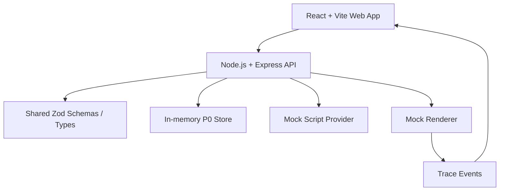

# ShopClip AI 🎬

ShopClip AI 是一个面向电商商家的 AIGC 带货短视频生成工作台。它把商品 brief、素材元数据、脚本生成、分镜编辑、渲染 trace、预览和导出串成一条可演示的 P0 主链路，适合评审快速理解项目价值，也方便后续继续扩展 P1 能力。

## ✨ 当前状态

- ✅ P0 后端链路已完成：项目、素材、脚本/分镜、渲染任务、trace、导出。
- ✅ P0 前端链路已完成：4 个页面分类承载完整 demo 流程。
- ✅ P0 浏览器验收已完成：Playwright 跑通 create project -> asset -> storyboard -> studio edit -> render -> export。
- 🚧 P1 待开发：素材标签/检索、智能剪辑 Agent、局部分镜重生成、TTS/字幕/BGM、失败重试、Mock 数据看板。

## 🧭 Demo 流程

本地启动后打开 `http://localhost:5173/#project`。

1. `Project command center`：创建或加载一个商品视频项目。
2. `Creative prep`：上传商品素材元数据并生成脚本/分镜。
3. `Generation studio`：查看 9:16 预览、编辑分镜字段并保存本地修改。
4. `Delivery room`：启动渲染、查看 trace、预览 fallback artifact 并导出 demo video。

P0 自动化证据在：

- `projects/shopclip-ai/evidence/p0-browser-verification.md`
- `projects/shopclip-ai/evidence/p0-*.png`

## 🏗️ 架构



### Monorepo 结构

```text
apps/
  api/          Node.js API, P0 lifecycle endpoints, mock providers
  web/          React/Vite workspace UI and Playwright E2E
packages/
  shared/       Shared TypeScript types, Zod schemas, health payloads
projects/
  shopclip-ai/  Requirements, design spec, development plan, part docs, evidence
```

## 🧩 技术栈

- Frontend: React 19, Vite, TypeScript, lucide-react
- Backend: Node.js, Express, TypeScript
- Contracts: Zod + shared workspace package
- Testing: Vitest, Playwright
- Package manager: pnpm via Corepack
- Current persistence: deterministic in-memory P0 store
- Planned persistence: PostgreSQL + Prisma

## 🚀 本地启动

### 1. 安装依赖

```bash
corepack enable
corepack pnpm install
```

### 2. 配置环境变量

复制 `.env.example` 为本地环境文件，按需调整端口和 mock/provider 配置。

```bash
cp .env.example .env
```

Windows PowerShell 可使用：

```powershell
Copy-Item .env.example .env
```

P0 默认使用 mock/fallback provider，不需要真实 AI API key。

### 3. 启动 API + Web

```bash
corepack pnpm dev
```

默认地址：

- Web: `http://localhost:5173`
- API health: `http://localhost:4000/health`

## 🧪 验证命令

```bash
corepack pnpm lint
corepack pnpm test
corepack pnpm typecheck
corepack pnpm build
corepack pnpm --filter @shopclip/web test:e2e
```

Playwright 默认使用 Microsoft Edge channel。必要时可以覆盖：

```bash
PLAYWRIGHT_CHANNEL=chrome corepack pnpm --filter @shopclip/web test:e2e
```

Windows PowerShell：

```powershell
$env:PLAYWRIGHT_CHANNEL="chrome"
corepack pnpm --filter @shopclip/web test:e2e
```

## 🔌 P0 API

| Method | Endpoint | Purpose |
| --- | --- | --- |
| `GET` | `/health` | API health check |
| `POST` | `/api/projects` | Create a project with product brief |
| `GET` | `/api/projects/:projectId` | Load a project snapshot |
| `POST` | `/api/projects/:projectId/assets` | Add asset metadata |
| `POST` | `/api/projects/:projectId/generate-script` | Generate fallback script and storyboard |
| `POST` | `/api/projects/:projectId/render` | Create a mock render task and trace events |
| `GET` | `/api/render-tasks/:renderTaskId` | Load render task and trace snapshot |
| `GET` | `/api/projects/:projectId/export` | Export completed preview artifact |

## 🛡️ 安全与配置

- 不要把真实 API key、endpoint secret 或数据库密码提交到仓库。
- 前端只通过 API 调用业务能力，不直接调用模型 provider。
- `.env.example` 只保留示例变量；真实配置应放在本地 `.env` 或部署平台 secret 中。
- `.agents/memory/` 是本地私有记忆目录，不应提交。

## 📚 项目文档

- Requirements: `projects/shopclip-ai/00-requirements.md`
- Design spec: `projects/shopclip-ai/01-design-spec.md`
- Development plan: `projects/shopclip-ai/02-development-plan.md`
- P0 frontend part: `projects/shopclip-ai/parts/part-004-p0-frontend-flow.md`
- P0 browser gate: `projects/shopclip-ai/parts/part-005-p0-integration-and-browser-verification.md`

## 🧱 下一步

P0 gate 已通过，后续应按计划从 Part 006 开始推进 P1：

1. 素材标签与检索。
2. 分镜编辑、局部重生成与编辑 Agent。
3. TTS、字幕、BGM、失败重试与 trace 强化。
4. Mock 数据看板。
5. Render 部署、最终文档、安全复核与交付证据。
