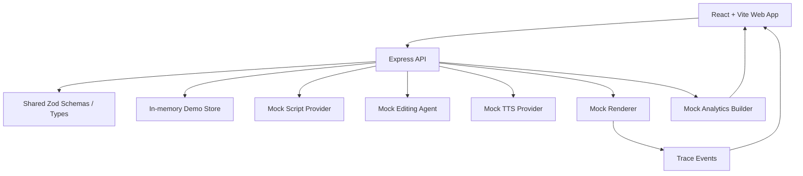

# ShopClip AI

ShopClip AI is a React + Node.js demo workspace for ecommerce short-video generation. It turns a product brief and asset metadata into a storyboard, editable scenes, render trace, preview/export artifact, and mock performance dashboard.

The project is intentionally demo-stable: all P0 and P1 flows can run with deterministic mock providers, while the server-side provider boundaries leave room for real AI, TTS, video rendering, storage, and database integrations later.

## Current Scope

- P0 end-to-end flow: project setup, asset metadata upload, storyboard generation, studio editing, render trace, preview, and export.
- P1 flow: asset tagging/search, scene editing and local regeneration, Editing Agent suggestions, TTS/subtitle/BGM render settings, failed-render retry, and mock analytics dashboard.
- Browser evidence lives under `projects/shopclip-ai/evidence/`.

## Latest Delivery Status

- Tasks 06-10 are complete: P1 asset retrieval, scene editor/Editing Agent, media controls and retry, mock dashboard, Render deployment docs, and final security evidence.
- Latest verification passed: `corepack pnpm test`, `corepack pnpm typecheck`, `corepack pnpm lint`, `corepack pnpm build`, and `corepack pnpm --filter @shopclip/web test:e2e`.
- Final handoff is documented in `projects/shopclip-ai/evidence/final-handoff.md`.
- Work summary is maintained in `report.md`.

## Tech Stack

- Frontend: React 19, Vite, TypeScript, lucide-react
- Backend: Node.js, Express, TypeScript
- Contracts: shared Zod schemas and TypeScript types in `packages/shared`
- Tests: Vitest and Playwright
- Package manager: pnpm via Corepack
- Current persistence: deterministic in-memory store
- Planned production persistence: PostgreSQL + Prisma

## Directory Structure

```text
apps/
  api/          Express API, lifecycle endpoints, mock providers
  web/          React workspace UI and Playwright E2E tests
packages/
  shared/       Zod schemas, shared TypeScript types, health payloads
projects/
  shopclip-ai/  Requirements, design, development plan, part docs, evidence
render.yaml     Render Blueprint for API + static web services
```

## Local Setup

```bash
corepack enable
corepack pnpm install
```

Create a local environment file:

```bash
cp .env.example .env
```

PowerShell:

```powershell
Copy-Item .env.example .env
```

Start both apps:

```bash
corepack pnpm dev
```

Default URLs:

- Web: `http://localhost:5173/#project`
- API health: `http://localhost:4000/health`

## Environment Variables

| Variable               | Used by | Required               | Notes                                                                              |
| ---------------------- | ------- | ---------------------- | ---------------------------------------------------------------------------------- |
| `PORT`                 | API     | Local optional         | Render provides this automatically.                                                |
| `CORS_ORIGIN`          | API     | Yes in production      | Comma-separated allowed web origins.                                               |
| `JSON_BODY_LIMIT`      | API     | Optional               | Defaults to `1mb`.                                                                 |
| `VITE_API_URL`         | Web     | Yes in production      | Public API base URL, for example `https://<api>.onrender.com/api`.                 |
| `DATABASE_URL`         | API     | Future                 | Present for planned Prisma/PostgreSQL integration. Current demo uses memory store. |
| `AI_PROVIDER_MODE`     | API     | Optional               | Use `mock` for deterministic demo mode.                                            |
| `AI_API_KEY`           | API     | Only for real provider | Server-side secret. Do not expose to the web app.                                  |
| `AI_TEXT_ENDPOINT_ID`  | API     | Only for real provider | Server-side provider config.                                                       |
| `AI_VIDEO_ENDPOINT_ID` | API     | Only for real provider | Server-side provider config.                                                       |
| `TTS_PROVIDER_MODE`    | API     | Optional               | Use `mock` for deterministic demo mode.                                            |
| `TTS_API_KEY`          | API     | Only for real provider | Server-side secret.                                                                |

## Demo Flow

1. Open `Project command center` and create a project.
2. Open `Creative prep`, upload asset metadata, and generate the storyboard.
3. Open `Generation studio`, edit scene fields, save edits, search assets, and apply an Editing Agent suggestion.
4. Open `Delivery room`, choose TTS/subtitle/BGM settings, render, optionally simulate failure, retry, and export.
5. Open `Analytics dashboard` and load mock performance metrics.

## API Summary

| Method  | Endpoint                                   | Purpose                           |
| ------- | ------------------------------------------ | --------------------------------- |
| `GET`   | `/health`                                  | Health check                      |
| `POST`  | `/api/projects`                            | Create project                    |
| `GET`   | `/api/projects/:projectId`                 | Load project snapshot             |
| `POST`  | `/api/projects/:projectId/assets`          | Add asset metadata                |
| `POST`  | `/api/projects/:projectId/generate-script` | Generate script and storyboard    |
| `GET`   | `/api/assets/search`                       | Search tagged assets              |
| `PATCH` | `/api/scenes/:sceneId`                     | Save scene edits                  |
| `POST`  | `/api/scenes/:sceneId/regenerate`          | Regenerate one scene              |
| `GET`   | `/api/scenes/:sceneId/suggestions`         | Load Editing Agent suggestions    |
| `POST`  | `/api/projects/:projectId/render`          | Start mock render                 |
| `GET`   | `/api/render-tasks/:renderTaskId`          | Load render task and trace        |
| `POST`  | `/api/render-tasks/:renderTaskId/retry`    | Retry failed render               |
| `GET`   | `/api/projects/:projectId/export`          | Export completed preview artifact |
| `GET`   | `/api/projects/:projectId/dashboard`       | Load mock dashboard               |

## Architecture



## Fallback Behavior

- Script/storyboard generation uses deterministic mock output.
- Editing Agent suggestions are deterministic and explainable.
- TTS, subtitle overlay, BGM, render artifacts, and dashboard metrics are mock metadata-backed outputs.
- Failed render simulation is available in the UI and can be retried without losing project data.
- Real provider keys must stay server-side. The browser never calls model or TTS providers directly.

## Verification

```bash
corepack pnpm test
corepack pnpm typecheck
corepack pnpm lint
corepack pnpm build
corepack pnpm --filter @shopclip/web test:e2e
```

The latest local verification for Tasks 06-10 is recorded in `report.md` and in `projects/shopclip-ai/evidence/`.

## Render Deployment

This repository includes a Render Blueprint at `render.yaml` with:

- `shopclip-ai-api`: Node web service for `apps/api`
- `shopclip-ai-web`: static site for `apps/web`

Deployment steps:

1. Push this repository to GitHub/GitLab/Bitbucket.
2. In Render, create a new Blueprint from the repo and select `render.yaml`.
3. Set `CORS_ORIGIN` on `shopclip-ai-api` to the final static site URL.
4. Set `VITE_API_URL` on `shopclip-ai-web` to the final API URL plus `/api`.
5. Keep `AI_PROVIDER_MODE=mock` and `TTS_PROVIDER_MODE=mock` unless real provider secrets are configured.
6. Deploy and verify `/health`, then run the demo flow in the browser.

The current repository state provides a documented deployment path and local browser evidence. A live Render URL still requires account-side Blueprint creation and environment variable entry.

## Security Notes

- Do not commit real `.env` files, API keys, provider tokens, or database passwords.
- `.env.example` contains placeholders only.
- The Express API disables `X-Powered-By`, sets baseline browser security headers, uses explicit CORS origins, and limits JSON request bodies.
- The React app only receives `VITE_API_URL`, which is public by design.
- `.agents/memory/` is local private memory and is ignored by git.

## Project Documents

- Requirements: `projects/shopclip-ai/00-requirements.md`
- Design spec: `projects/shopclip-ai/01-design-spec.md`
- Development plan: `projects/shopclip-ai/02-development-plan.md`
- Final handoff: `projects/shopclip-ai/evidence/final-handoff.md`
