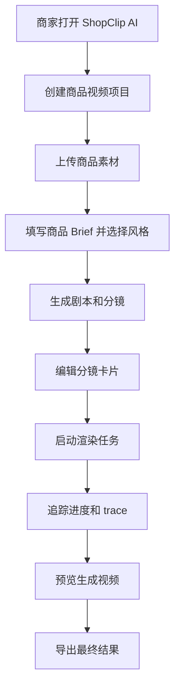

# ShopClip AI 需求文档

## 文档状态

- 项目 slug：shopclip-ai
- Owner：金宇辰
- 创建日期：2026-05-21
- 最后更新：2026-05-21
- 状态：Approved

## 项目摘要

ShopClip AI 是一个面向电商商家的 AIGC 带货短视频生成工作台。商家可以上传商品素材，生成转化导向的剧本与分镜，逐镜编辑内容，追踪生成任务进度，预览成片，并导出适配 TikTok Shop 等渠道的短视频。

## 项目目标

- 交付一个评委可以快速访问和理解价值的在线 Demo。
- 完成完整 P0 主链路：素材上传、剧本生成、分镜生成、一键成片、任务进度、预览、导出。
- 在 P0 稳定后完成全部 P1 能力：素材标签/Embedding 检索、智能剪辑 Agent、分镜级编辑、TTS/字幕/BGM、失败重试、生成 trace、Mock 数据看板。
- 生成链路采用混合方案：剧本/文案/TTS 尽量使用真实 API，视频生成允许使用 mock 或预置样例兜底，保证 Demo 稳定。
- 通过 React、Node.js、TypeScript、PostgreSQL、Prisma、部署文档和交接材料体现完整全栈工程能力。

## 目标用户

| 用户角色 | 需求 | 痛点 | 成功结果 |
| --- | --- | --- | --- |
| 电商商家 | 快速用商品素材生成带货短视频 | 手工剪辑慢、成本高、需要编辑能力 | 能在一个引导式流程中生成可用短视频 |
| 增长/营销运营 | 测试不同 hook、文案、字幕和视觉风格 | 内容变体迭代慢，生成过程不透明 | 能调整分镜并局部重生成，不需要从头开始 |
| 评委/审核者 | 快速理解项目价值并复核 Demo | 很多 Demo 设置复杂、凭证不清晰 | 能打开部署链接，顺着流程体验，并查看 README/架构 |

## 核心功能

| 功能 | 优先级 | 描述 | 验收标准 |
| --- | --- | --- | --- |
| 商品素材上传 | Must | 上传商品图片、短视频和参考素材 | 用户可以添加素材，并看到素材列表与元数据 |
| 商品 Brief 输入 | Must | 录入商品标题、卖点、人群、语气和场景 | Brief 被保存并用于剧本/分镜生成 |
| 剧本生成 | Must | 基于商品 Brief 和风格生成电商视频剧本 | 返回 hook、卖点、旁白、字幕和约束 |
| 基础分镜 | Must | 将剧本转换为 15 秒以内的视频分镜 | 分镜包含顺序、时长、画面描述、文案、旁白和素材位 |
| 一键成片 | Must | 基于分镜和素材提交渲染任务 | 用户可以启动生成任务并看到进度直到预览可用 |
| 任务进度与 trace | Must | 展示长任务状态、当前步骤、失败/重试和 trace 事件 | 用户不会面对空白等待，失败时知道原因和恢复动作 |
| 预览与导出 | Must | 预览生成结果并导出 Demo 成片 | 用户可以播放预览并下载/导出视频或演示产物 |
| 素材标签与 Embedding 检索 | P1 | 支持对素材和切片做关键词、标签、向量相似检索 | 用户可以搜索或自动召回适合剧本/分镜的素材 |
| 智能剪辑 Agent | P1 | 基于分镜和素材推荐镜头、素材、字幕和时长调整 | 用户可以应用至少一条 AI 编辑建议 |
| 分镜级编辑器 | P1 | 在不重写整条视频的情况下编辑单个分镜 | 用户可修改时长、字幕、旁白、风格和素材 |
| 局部重生成 | P1 | 基于用户修改重生成单个分镜或文本块 | 用户刷新一个分镜时，其他分镜保持不变 |
| TTS/字幕/BGM | P1 | 提供旁白音频、字幕叠加和背景音乐选择 | 预览中包含同步或近似同步的旁白、字幕和音乐层 |
| 失败重试 | P1 | 支持失败生成步骤重试并保留已成功结果 | 失败任务可从明确状态重试，不丢失项目数据 |
| Mock 数据看板 | P1 | 展示生成因子和模拟转化效果 | 用户可以查看创意因子与 mock 转化结果的关系 |

## 详细需求

### 功能需求

- FR-001：用户可以为一个商品创建视频项目。
- FR-002：用户可以上传商品图片和可选短视频/参考素材。
- FR-003：用户可以填写商品标题、卖点、目标人群和创意风格。
- FR-004：系统可以基于商品信息和风格/模板生成剧本。
- FR-005：系统可以生成包含时长、画面描述、字幕、旁白和素材引用的分镜。
- FR-006：用户可以编辑分镜字段，并在第一版编辑器支持时进行重排或删除。
- FR-007：用户可以重生成剧本或单个分镜，同时保留项目状态。
- FR-008：用户可以提交视频渲染任务，并查看进度、trace、重试和完成/失败状态。
- FR-009：用户可以在浏览器中预览生成结果。
- FR-010：用户可以导出或下载生成结果。
- FR-011：即使外部生成 API 不可用，Demo 也必须支持至少一条稳定端到端样例。
- FR-012：系统可以为素材生成标签，并支持关键词/标签/Embedding 风格检索，供剧本和分镜使用。
- FR-013：系统包含智能剪辑 Agent 或推荐流程，可建议分镜、素材、字幕或时长优化。
- FR-014：系统包含 Mock 数据看板，用于可视化生成因子和模拟效果指标。

### 非功能需求

- 性能：首屏应足够快，适合现场演示；长任务必须立即给出进度反馈。
- 安全：模型凭证和云 API Key 不得出现在前端代码或仓库中，必须使用服务端环境变量。
- 隐私：上传的 Demo 素材只在项目范围内使用，种子数据不得包含敏感真实商家数据。
- 可访问性：核心流程需要清晰标签、可见焦点、足够对比度和响应式布局。
- 兼容性：主要面向现代桌面 Chrome/Edge；移动端应能完成查看和轻量编辑。
- 可靠性：外部 AI/API 失败时必须降级为确定性 Demo 输出或清晰重试状态。

## 用户流程

## 范围

### 范围内

- React + TypeScript 前端。
- Node.js + TypeScript 后端。
- PostgreSQL + Prisma 持久化。
- Render 部署前端、后端和 PostgreSQL。
- 从素材上传到预览/导出的 P0 闭环。
- P0 完成后的全部 P1 能力：素材标签/Embedding 检索、智能剪辑 Agent、分镜级编辑、局部重生成、TTS/字幕/BGM、生成 trace、重试/失败状态、Mock 数据看板。
- 混合 AI 路径：剧本/TTS 尽量真实接入，视频生成使用确定性 mock 或预置素材兜底。
- README、架构说明、部署说明和交接材料。

### 范围外

- 真实 TikTok Shop 后台接入。
- 真实投流、广告发布或转化数据接入。
- 生产级版权检测或法律审核服务。
- 对任意输入都保证真实文生视频生成成功。
- 多用户团队协作、计费或权限系统。
- P2 专属能力，如多因子归因、A/B 实验自动化、生产级可观测性、完整合规审核流、生产级 Agent 编排。

## 约束

- 技术：项目从零开始，必须作为单一 Git 仓库实现，并保持清晰前后端分离。
- 业务：Demo 需要讲清电商增长故事，并快速展示 AI 价值。
- 时间：按 2-3 人团队、1-2 周规划。
- 成本：优先免费或低成本部署和模型使用；昂贵生成必须有 fallback。
- 法务/合规：Demo 使用自有、公开可用或 mock 素材；敏感云凭证只来自环境变量。
- 提交：最终材料需包含部署 Demo、源码仓库、README、架构图、演示视频和成员分工。
- 交付顺序：必须先实现并验证 P0；P1 也是最终必做，但只有在 P0 可端到端使用后再开始。

## 风险

| 风险 | 影响 | 可能性 | 缓解 |
| --- | --- | --- | --- |
| 真实视频生成慢、贵或不稳定 | 评审演示可能失败 | 高 | 使用 mock/预置视频兜底，并明确展示 trace |
| P1 范围过宽影响 P0 完成 | 核心链路可能做不完 | 中 | 设置交付门禁：先完成并验证 P0，再按顺序实现 P1 |
| API 凭证泄漏 | 安全和资源风险 | 中 | 只用服务端环境变量，代码和文档不写明文密钥 |
| Render 部署复杂度拖慢进度 | Demo 访问可能延迟 | 中 | 尽早加入部署配置和 smoke check |
| 分镜编辑器复杂度过高 | UI 可能不完整或不稳定 | 中 | 先做分镜卡片 + 预览，再加时间轴增强 |

## 待确认问题

- [ ] 评委演示用的具体商品品类和样例素材是什么？
- [ ] 第一版导出应是真实拼接 MP4、生成预览产物，还是两者都支持？
- [ ] 生产 Demo 使用哪个 TTS/模型 endpoint？fallback 素材是什么？
- [ ] 是否需要登录/认证，还是使用匿名 seeded demo？
- [ ] 最终团队成员姓名、学校、专业和模块分工是什么？

## 审批

- 用户确认：Yes
- 确认日期：2026-05-21
- 备注：用户已确认。方向：B 目标版本、C 在线部署、C 混合生成、React/Node/TypeScript/PostgreSQL/Prisma、Render 部署、2-3 人团队、从零开始、项目名 ShopClip AI。用户补充要求：P0 和 P1 都纳入范围，先做 P0，再做 P1。
