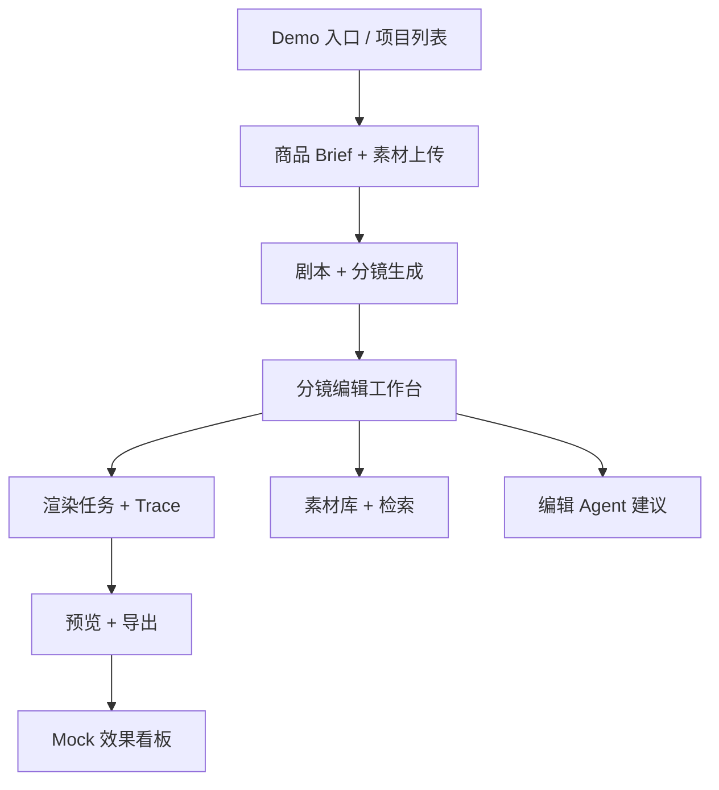
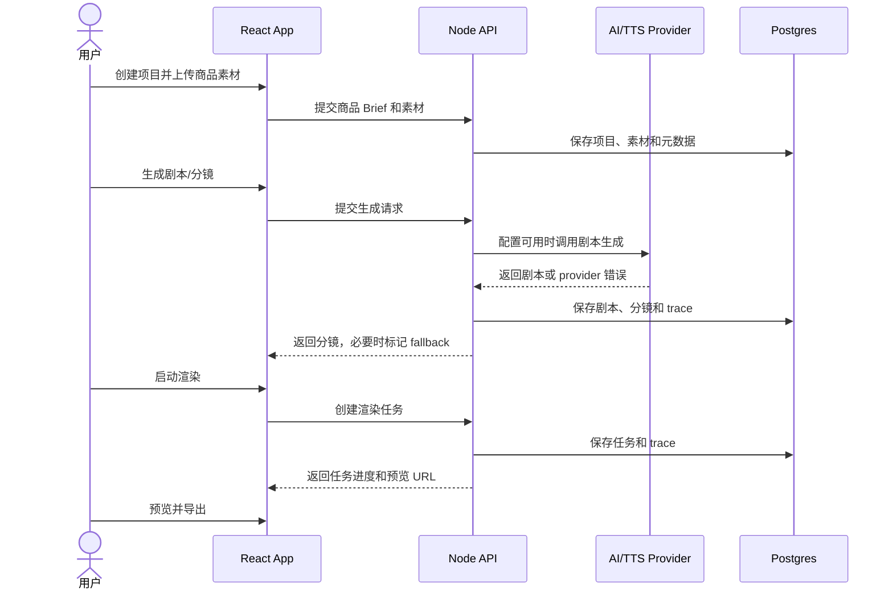
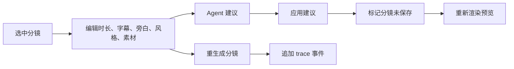
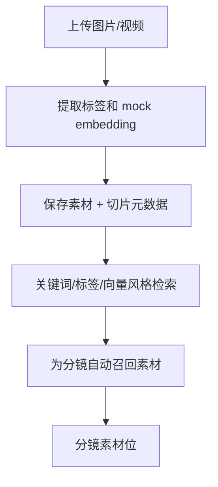
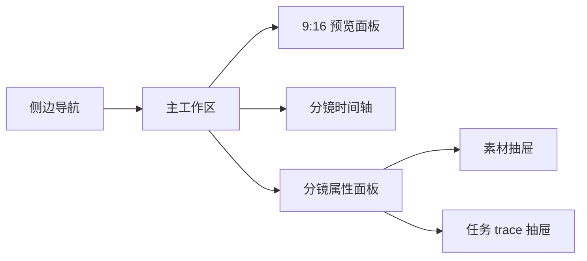
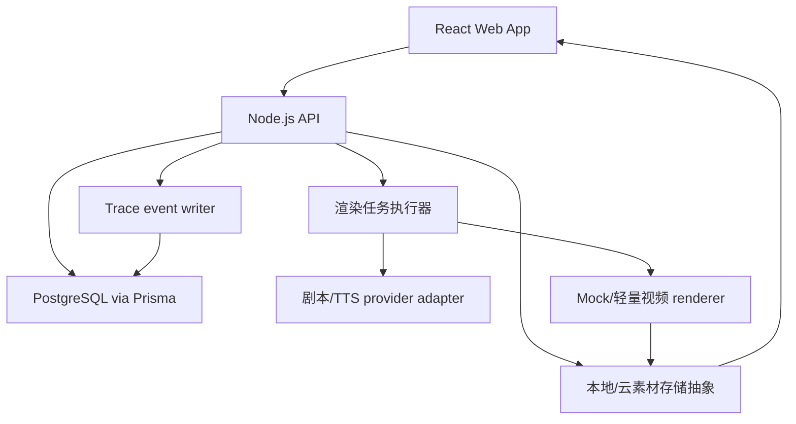
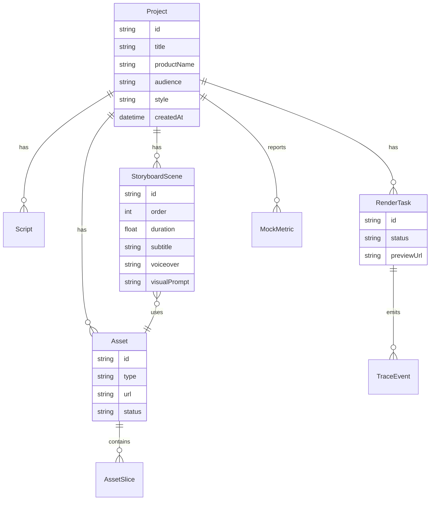

# ShopClip AI 设计规范

## 文档状态

- 项目 slug：shopclip-ai
- 基于需求：`projects/shopclip-ai/00-requirements.md`
- 创建日期：2026-05-21
- 最后更新：2026-05-21
- 状态：Approved

## 设计目标

- 让第一条 Demo 路径足够清晰：上传素材、生成分镜、编辑分镜、渲染、预览、导出。
- 将 P0 作为完整端到端主链路优先完成，再在同一导航模型上叠加全部 P1 能力。
- 通过步骤进度、trace 事件、重试动作和可恢复错误，让长任务可观察。
- 将分镜编辑器作为产品核心，在桌面端同时展示预览、分镜、素材和编辑控制。
- 降低评委体验门槛：第一版使用匿名 seeded demo，不强制登录，除非部署保护要求必须登录。

## 产品结构

## 信息架构

- 导航：桌面端使用左侧边栏；移动端使用顶部 tabs 或底部抽屉式导航。
- 主模块：Projects、Assets、Studio、Render Trace、Dashboard、Settings。
- 核心对象：Project、Product Brief、Asset、Asset Slice、Script、Storyboard Scene、Render Task、Trace Event、Export、Mock Metric。
- 权限视图：第一版使用匿名 Demo 模式。除非部署保护需要，否则不做管理员/登录视图。

## 页面清单

| 页面 | 目的 | 主要用户 | 关键状态 |
| --- | --- | --- | --- |
| Demo 入口 / 项目列表 | 从 seeded demo 开始或创建新项目 | 商家、评委 | 加载、空状态、seeded demo、错误 |
| 商品设置 | 录入商品 Brief 并上传素材 | 商家 | 上传中、校验错误、草稿已保存、可生成 |
| 素材库 | 查看上传素材、标签、切片和检索结果 | 商家、运营 | 空状态、处理中、已打标、搜索结果、打标失败 |
| 剧本生成器 | 生成并查看 hook、旁白、约束和分镜草稿 | 商家、运营 | 生成中、已生成、部分失败、重生成 |
| Studio 编辑器 | 分镜级编辑主工作台 | 商家、运营 | 草稿、编辑中、未保存、局部重生成、校验错误 |
| 渲染任务面板 | 追踪渲染进度和生成 trace | 商家、评委 | 排队中、运行中、可重试失败、完成 |
| 预览 / 导出 | 播放输出并下载/导出结果 | 商家、评委 | 处理中、可播放、播放错误、导出成功 |
| Mock 看板 | 展示创意因子和模拟效果 | 运营、评委 | 空状态、已加载、已筛选、图表错误 |
| 设置 / 环境提示 | 说明 Demo 模式、API fallback 模式和部署状态 | 评委、开发者 | 已配置、仅 fallback、缺少服务端配置 |

## 交互流程

### P0 端到端流程

### P1 编辑流程

### P1 素材检索流程

## 视觉方向

- 风格：深色、工具型创作工作台。使用视频/编辑器隐喻，不把营销落地页作为首屏主体验。
- 色彩系统：深色中性背景、高对比白色文字；生成动作使用洋红主色；时间轴/trace 使用蓝色强调；失败和状态使用语义红/黄/绿。
- 字体：精准、SaaS/editor 语气。UI 使用高可读无衬线；时间、trace ID、进度数字可使用等宽或表格数字。
- 图标：使用 lucide 风格线性图标，如上传、重生成、播放、导出、时间轴、重试、设置、看板。结构性图标不使用 emoji。
- 信息密度：偏操作型、便于扫描。面板紧凑但标签清晰；视频预览、时间轴、分镜卡片、任务 trace 使用稳定尺寸。
- 动效：只使用轻量状态过渡。生成进度可以动效展示，但编辑控制必须保持响应，并支持 reduced motion。

## 布局模型

桌面端 Studio 工作台：

推荐桌面比例：

- 左侧边栏：折叠 72px，展开约 240px。
- 中央预览 + 时间轴：最大视觉区域，视频预览保持稳定 9:16 比例。
- 右侧属性面板：360-420px，用于分镜字段、AI 建议和已选素材。
- 底部时间轴：横向滚动分镜卡片，提供键盘替代操作和新增/删除按钮。

移动端策略：

- 将 Studio 转成分阶段 tabs：Preview、Scenes、Assets、Trace。
- 底部固定主操作：根据当前阶段显示 Generate、Render、Export。
- 避免在移动端塞入高密度多面板编辑；移动端主要用于查看和轻量修改。

## 组件规范

| 组件 | 用途 | 状态 | 备注 |
| --- | --- | --- | --- |
| 项目卡片 | 进入某个商品视频项目 | 空、就绪、渲染中、完成、失败 | 包含状态 chip 和最后更新时间 |
| 素材上传器 | 上传商品图片/视频 | 空闲、拖拽中、上传中、错误、完成 | 上传前校验文件类型和大小 |
| 素材标签 | 展示类目、商品、风格和切片元数据 | 普通、选中、禁用 | 标签可搜索；用户自建标签可移除 |
| 剧本面板 | 查看 hook、叙事、约束 | 加载中、已生成、已编辑、错误 | 区分系统生成和用户编辑 |
| 分镜卡片 | 表示一个分镜 | 选中、未保存、重生成中、失败 | 尺寸稳定，状态变化不引发布局跳动 |
| 时间轴 | 排列和导航分镜 | 空、已填充、拖拽中、键盘重排 | 拖拽必须有按钮式替代操作 |
| 分镜属性面板 | 编辑分镜详情 | 原始、未保存、保存中、校验错误 | 字段标签始终可见 |
| 预览播放器 | 播放生成结果 | 加载中、可播放、静音、错误 | 预留 9:16 区域，避免 CLS |
| 任务 trace | 展示生成事件 | 排队中、运行中、可重试、完成 | 包含步骤、时间、状态和恢复动作 |
| Agent 建议 | 展示 AI 编辑建议 | 加载中、可用、已应用、已忽略 | 建议必须解释为什么有帮助 |
| 看板图表 | 展示 mock 因子/效果指标 | 已加载、已筛选、错误 | 数值和标签必须可见，不能只靠颜色 |

## 看板设计

P1 看板应轻量但可信：

- 汇总卡：预测完播率、hook 强度、字幕清晰度、商品聚焦度。
- 漏斗图：Impression -> Watch 3s -> Click -> Add to cart -> Purchase，使用 mock 数据。
- Bullet chart：3-6 个创意因子与目标区间对比。
- 因子表：分镜、因子、预期影响、证据说明和建议动作。

## 系统架构

架构说明：

- 前端永远不直接调用模型 provider。
- 后端通过 provider adapter 统一真实 API 和 mock fallback 合同。
- 渲染任务需要持久化，刷新页面不丢失进度。
- Trace event 是一等数据记录，不只是日志，前端可以直接展示。
- 素材存储从本地磁盘或 Render 兼容抽象开始；后续可替换为生产存储。

## 数据模型草图

## API 草案

| Endpoint | 用途 | 优先级 |
| --- | --- | --- |
| `POST /api/projects` | 创建带商品 Brief 的项目 | P0 |
| `GET /api/projects/:id` | 加载项目工作台 | P0 |
| `POST /api/projects/:id/assets` | 上传素材 | P0 |
| `POST /api/projects/:id/generate-script` | 生成剧本和分镜 | P0 |
| `PATCH /api/scenes/:id` | 编辑分镜字段 | P0/P1 |
| `POST /api/scenes/:id/regenerate` | 重生成单个分镜 | P1 |
| `POST /api/projects/:id/render` | 启动渲染任务 | P0 |
| `GET /api/render-tasks/:id` | 轮询任务状态和 trace | P0 |
| `GET /api/projects/:id/dashboard` | 加载 mock 效果看板 | P1 |
| `GET /api/assets/search` | 按关键词/标签/向量风格检索素材 | P1 |

## 响应式策略

- 移动端：单列引导流程，使用 Preview、Scenes、Assets、Trace tabs。最小触控目标 44px。底部固定主操作。
- 平板：双栏编辑器，预览在上方或左侧，分镜/属性面板堆叠。
- 桌面：三栏编辑器 + 底部时间轴。
- 宽屏：限制内容宽度，不无限拉伸预览；多余空间用于 trace/看板侧栏。

## 可访问性要求

- 键盘：主操作、分镜选择、重排、重试、预览控制和导出都必须键盘可达。
- 屏幕阅读器：素材预览、任务进度、trace 状态、错误和图表摘要需要可访问名称或文本摘要。
- 对比度：普通文本至少 4.5:1；状态颜色必须配合文本标签。
- 焦点状态：按钮、分镜卡片、tabs、上传区和表单控件需要可见焦点环。
- Reduced motion：关闭装饰性时间轴/进度动效，状态变化仍需可读。
- 表单：可见标签、文件限制帮助文案、内联校验和错误恢复动作。

## 设计产物

- Figma：暂未创建。
- 截图：实现阶段采集。
- 图表：本文已包含产品结构、交互流程、布局模型、系统架构和数据模型 Mermaid 图。

## 设计评审清单

- [x] 覆盖所有已确认需求。
- [x] 覆盖加载、空状态、错误、禁用和成功状态。
- [x] 覆盖响应式行为。
- [x] 覆盖可访问性要求。
- [x] 用户已确认设计方向。

## 审批

- 用户确认：Yes
- 确认日期：2026-05-21
- 备注：用户已确认。P0 仍是第一实现门禁；P1 在 P0 后全部完成，并已体现在信息架构、组件、API 和看板设计中。
