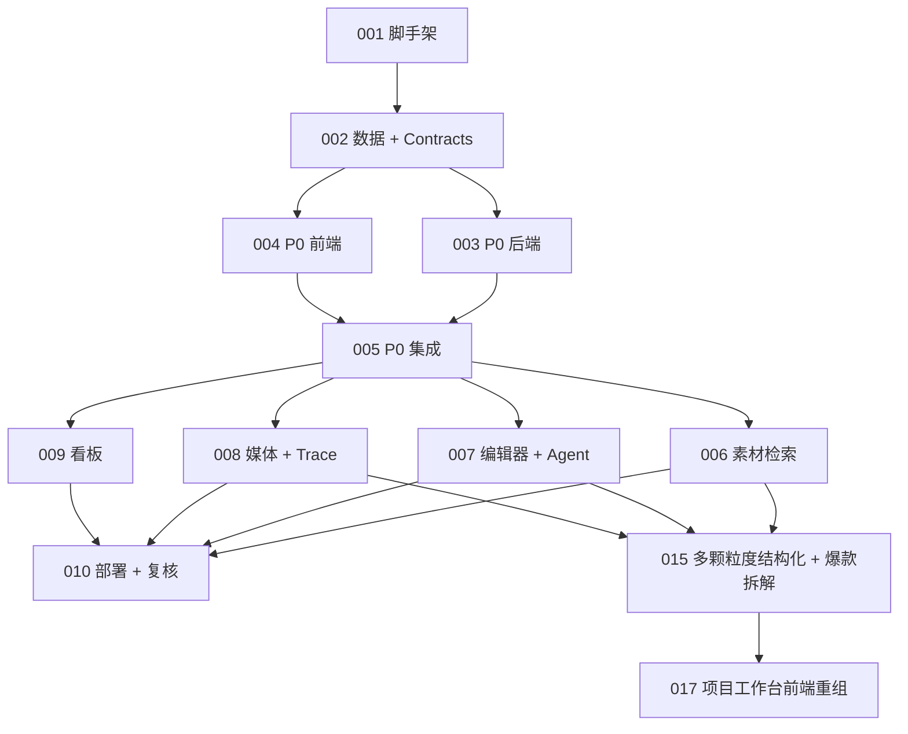

# ShopClip AI 开发计划

> **给后续 Agent/执行者：**实现本计划时必须使用 `superpowers:subagent-driven-development`（推荐）或 `superpowers:executing-plans`，按任务逐项执行。步骤使用 checkbox（`- [ ]`）追踪状态。

**目标：**构建并部署 ShopClip AI，一个 React + Node.js + TypeScript + PostgreSQL 的电商带货短视频生成 Demo，先完成 P0，再完成全部 P1。

**架构：**单仓库包含 `apps/web` 和 `apps/api`，共享类型放在 `packages/shared`，使用 Prisma 持久化，AI/TTS 使用真实 provider adapter + 确定性 fallback，部署到 Render。P0 先建立项目 -> 素材 -> 剧本/分镜 -> 渲染 trace -> 预览/导出闭环；P1 再加入素材检索、编辑 Agent、分镜重生成、媒体控制、重试增强和看板。

**技术栈：**React、Vite、TypeScript、Node.js、Express 或 Fastify、Prisma、PostgreSQL、Vitest、Playwright、Render。

---

## 文档状态

- 项目 slug：shopclip-ai
- 基于需求：`projects/shopclip-ai/00-requirements.md`
- 基于设计：`projects/shopclip-ai/01-design-spec.md`
- 创建日期：2026-05-21
- 最后更新：2026-05-22
- 状态：Draft

## 技术概览

- 技术栈：React + TypeScript 前端，Node.js + TypeScript 后端，PostgreSQL + Prisma。
- 架构：单仓库前后端分离，使用共享 contracts 和 provider adapters。
- 关键依赖：React Router、TanStack Query、Prisma、Zod、multipart 上传中间件、Vitest、Playwright、Recharts 或自定义 SVG 图表、lucide-react。
- 环境：本地开发、Render preview/production、mock AI fallback 模式、真实 provider 配置模式。
- 部署目标：Render static site 部署 `apps/web`，Render web service 部署 `apps/api`，Render PostgreSQL 提供数据库。

## 建议仓库结构

```text
apps/
  web/
    src/
      app/
      components/
      features/
        projects/
        assets/
        script/
        studio/
        render/
        dashboard/
      lib/
      styles/
  api/
    prisma/
      schema.prisma
      seed.ts
    src/
      modules/
        projects/
        assets/
        generation/
        scenes/
        render/
        dashboard/
      providers/
        ai/
        tts/
        renderer/
      shared/
      server.ts
packages/
  shared/
    src/
      schemas.ts
      types.ts
projects/shopclip-ai/
  00-requirements.md
  01-design-spec.md
  02-development-plan.md
  parts/
```

## 开发原则

- 遵循 `AGENTS.md`。
- 编码前读取需求、设计规范、开发计划和当前 Part 文档。
- P0 是第一交付门禁。Part 005 验证 P0 端到端链路前，不开始 P1 实现。
- API contracts 放在共享 schemas 中，前后端复用。
- Provider 凭证只放服务端环境变量。不要提交 API key、endpoint 或任何 secret。
- 每个 Part 完成前必须在 Part 文档中记录验证证据。

## Part 拆解

| Part | 名称                                   | 负责角色                    | 依赖               | 可并行 | 状态    |
| ---- | -------------------------------------- | --------------------------- | ------------------ | ------ | ------- |
| 001  | 仓库脚手架与工具链                     | `implementation-engineer`   | 无                 | 否     | Done    |
| 002  | 数据模型、API contracts 与 seeded demo | `implementation-engineer`   | 001                | 否     | Planned |
| 003  | P0 后端链路                            | `implementation-engineer`   | 002                | 否     | Planned |
| 004  | P0 前端链路                            | `implementation-engineer`   | 002、003 contracts | 部分   | Planned |
| 005  | P0 集成与浏览器验证                    | `quality-security-engineer` | 003、004           | 否     | Planned |
| 006  | P1 素材标签与检索                      | `implementation-engineer`   | 005                | 是     | Done    |
| 007  | P1 分镜编辑、局部重生成与编辑 Agent    | `implementation-engineer`   | 005                | 是     | Done    |
| 008  | P1 TTS、字幕、BGM、重试与 trace 强化   | `implementation-engineer`   | 005                | 是     | Done    |
| 009  | P1 Mock 数据看板                       | `implementation-engineer`   | 005                | 是     | Done    |
| 010  | 部署、文档、安全复核与最终证据         | `delivery-ops-engineer`     | 006、007、008、009 | 否     | Done    |
| 011  | 灵感分区多模态素材生成                 | `implementation-engineer`   | 010                | 否     | Done    |
| 012  | 用户 API 设置与模型配置                | `implementation-engineer`   | 011                | 否     | Done    |
| 015  | 多颗粒度素材结构化、爆款视频拆解与智能剪辑计划 | `solution-architect` / `implementation-engineer` | 006、007、008 | 否 | Done |
| 017  | 项目工作台前端重组                     | `implementation-engineer`   | 014、016           | 否     | Done |

## 依赖图



## 集成计划

- 集成顺序：脚手架 -> 数据库/contracts -> P0 后端 -> P0 前端 -> P0 E2E -> P1 模块 -> 最终部署。
- 共享 contracts：Zod schemas 和 TypeScript types 放在 `packages/shared/src`。
- 合并策略：P1 parts 尽量写在相互独立的 feature 目录和 API modules，减少冲突。
- 冲突风险：Studio 编辑器 UI 会被媒体和 Agent 工作共同影响；Part 007 期间由一个人负责 `apps/web/src/features/studio`，Part 008 通过小型 props/contracts 接入。

## 测试与验证策略

- 单元测试：shared schema 解析、剧本 fallback 生成、分镜更新校验、检索排序、看板指标。
- 集成测试：API 项目生命周期、渲染任务生命周期、重试路径、看板 endpoint。
- E2E/浏览器测试：创建项目、上传 seeded asset、生成分镜、编辑分镜、渲染、预览/导出；Part 005 后，在 P1 各自 Part 中补充检索和看板检查。
- 安全检查：确认 secret 不进入前端构建或文档；校验上传类型/大小；provider 环境变量只在服务端使用。
- 人工验收：在 `projects/shopclip-ai/evidence/` 记录 P0 和最终 P1 演示证据。

## 发布策略

- 部署目标：Render static site、Render Node service、Render PostgreSQL。
- 配置/secret：`DATABASE_URL`、AI provider API key、AI endpoint IDs、TTS config、mock mode flag、asset storage path。
- 回滚：保留上一个 Render deploy；外部 API 失败时通过 mock mode 禁用真实 provider 调用。
- 监控：第一版使用 API logs 和持久化 trace events；生产级可观测性属于 P2。

## 开放风险

| 风险                             | Owner                       | 缓解                                                          |
| -------------------------------- | --------------------------- | ------------------------------------------------------------- |
| P1 范围在 P0 稳定前消耗过多时间  | `solution-architect`        | Part 005 强制作为 P0 门禁                                     |
| Provider API 延迟或额度影响 Demo | `implementation-engineer`   | 使用确定性 fallback provider 和 seeded sample                 |
| Render 文件系统持久化有限        | `delivery-ops-engineer`     | 抽象 storage，Demo 使用 seeded assets，并记录生产存储升级方案 |
| 分镜编辑器复杂度导致 UI 脆弱     | `quality-security-engineer` | 用浏览器测试覆盖核心编辑交互和稳定尺寸                        |

## Part 任务细节

### Task 001：仓库脚手架与工具链

**文件：**

- 创建：`package.json`、`pnpm-workspace.yaml`、`tsconfig.base.json`、`.env.example`、`.gitignore`、`apps/web/*`、`apps/api/*`、`packages/shared/*`
- 测试：初始 lint/typecheck/build 命令

- [ ] 创建 workspace 和脚本：`dev`、`build`、`typecheck`、`test`、`lint`、`format`。
- [ ] 在 `apps/web` 下创建 Vite React 应用。
- [ ] 在 `apps/api` 下创建 Node API 应用。
- [ ] 在 `packages/shared` 下创建共享包。
- [ ] 添加 ESLint、Prettier、TypeScript 配置和基础 CI 脚本。
- [ ] 运行 `pnpm install`、`pnpm typecheck`、`pnpm build`。

### Task 002：数据模型、API contracts 与 Seed Demo

**文件：**

- 创建：`apps/api/prisma/schema.prisma`、`apps/api/prisma/seed.ts`
- 创建：`packages/shared/src/schemas.ts`、`packages/shared/src/types.ts`
- 修改：`apps/api/src/server.ts`
- 测试：`apps/api/src/**/*.test.ts`、`packages/shared/src/**/*.test.ts`

- [ ] 定义 Prisma models：Project、Asset、AssetSlice、Script、StoryboardScene、RenderTask、TraceEvent、MockMetric。
- [ ] 定义 Zod schemas：project brief、asset metadata、script result、scene update、render task、trace event、dashboard response。
- [ ] 添加一个面向评委的安全 seeded demo 商品和 mock assets。
- [ ] 添加必填字段、时长约束、状态枚举和 dashboard response shape 测试。
- [ ] 本地运行 migration 和 seed。

### Task 003：P0 后端链路

**文件：**

- 创建：`apps/api/src/modules/projects/*`、`assets/*`、`generation/*`、`render/*`
- 创建：`apps/api/src/providers/ai/*`、`providers/renderer/*`
- 测试：API 集成测试

- [ ] 实现项目创建/加载 endpoints。
- [ ] 实现素材上传、类型/大小校验和本地存储抽象。
- [ ] 实现剧本/分镜生成 provider interface 和确定性 fallback。
- [ ] 实现渲染任务创建、trace event 持久化、进度轮询和 preview URL fallback。
- [ ] 实现 Demo 产物 export/download endpoint 或静态路径。
- [ ] 在不依赖前端的情况下测试完整 P0 API 生命周期。

### Task 004：P0 前端链路

**文件：**

- 创建：`apps/web/src/features/projects`、`assets`、`script`、`studio`、`render`
- 创建：`apps/web/src/components/layout`、`components/ui`、`lib/api.ts`
- 测试：必要组件测试

- [ ] 构建 app shell、侧边/顶部导航和深色编辑器设计 tokens。
- [ ] 构建项目入口和商品设置流程。
- [ ] 构建素材上传器和素材列表。
- [ ] 构建剧本/分镜生成页面。
- [ ] 构建 Studio 编辑器第一版：预览、分镜卡片、分镜属性面板、渲染 trace 面板。
- [ ] 构建预览/导出页面。
- [ ] 验证 375px、768px、1024px、1440px 响应式行为。

### Task 005：P0 集成与浏览器验证

**文件：**

- 创建：`apps/web/e2e/p0-flow.spec.ts`
- 创建证据：`projects/shopclip-ai/evidence/`
- 修改：Part 005 完成记录

- [ ] 启动本地 API 和 Web 应用。
- [ ] 使用 Playwright 运行自动化 P0 浏览器流程。
- [ ] 验证 P0 页面空状态、加载、错误、成功和可重试状态。
- [ ] 采集项目设置、Studio、trace、预览/导出截图或浏览器证据。
- [ ] 只有端到端预览/导出可用后，才能标记 P0 门禁通过。

### Task 006：P1 素材标签与检索

**文件：**

- 创建/修改：`apps/api/src/modules/assets`、`apps/api/src/modules/retrieval`
- 创建/修改：`apps/web/src/features/assets`
- 测试：检索排序测试和浏览器搜索检查

- [ ] 添加素材打标和切片元数据生成。
- [ ] 添加本地 Demo 模式的确定性 embedding-like 向量评分。
- [ ] 添加 `/api/assets/search` endpoint。
- [ ] 添加素材搜索/筛选 UI 和自动召回到分镜素材位的能力。
- [ ] 验证关键词、标签和向量风格检索样例。

### Task 007：P1 分镜编辑、局部重生成与编辑 Agent

**文件：**

- 修改：`apps/web/src/features/studio`
- 创建/修改：`apps/api/src/modules/scenes`、`apps/api/src/modules/generation`
- 创建：`apps/api/src/providers/ai/editingAgentProvider.ts`
- 测试：分镜更新和重生成测试、编辑器浏览器测试

- [ ] 添加可靠的分镜字段编辑、dirty state 和保存校验。
- [ ] 添加重排/删除控制，并提供键盘替代操作。
- [ ] 添加单分镜重生成 endpoint 和 UI action。
- [ ] 添加编辑 Agent 建议，支持解释、应用和忽略。
- [ ] 验证局部重生成后其他分镜保持不变。

### Task 008：P1 TTS、字幕、BGM、重试与 Trace 强化

**文件：**

- 创建/修改：`apps/api/src/providers/tts`、`apps/api/src/providers/renderer`
- 修改：`apps/api/src/modules/render`
- 修改：`apps/web/src/features/render`、`apps/web/src/features/studio`
- 测试：重试生命周期和媒体选项测试

- [ ] 添加 TTS provider adapter 和 mock fallback。
- [ ] 添加字幕和 BGM 的分镜/项目级控制。
- [ ] 为失败的渲染/生成步骤添加 retry action。
- [ ] 强化 trace event 状态和时间戳。
- [ ] 验证 mock mode 生成预览中能体现字幕和所选媒体设置。

### Task 009：P1 Mock 数据看板

**文件：**

- 创建：`apps/api/src/modules/dashboard`
- 创建：`apps/web/src/features/dashboard`
- 测试：dashboard endpoint 和图表渲染测试

- [x] 添加 mock metric seed 和 dashboard endpoint。
- [x] 添加完播率、hook 强度、字幕清晰度、商品聚焦度汇总卡。
- [x] 添加漏斗图、bullet chart grid 和因子表。
- [x] 为图表添加可访问文本摘要。
- [x] 验证看板可以从项目预览页进入，并能处理空状态/错误状态。

### Task 010：部署、文档、安全复核与最终证据

**文件：**

- 创建：`render.yaml`、`README.md`、部署文档、最终证据文件
- 修改：`.env.example` 和必要项目文档
- 测试：生产构建、smoke test、安全扫描/清单

- [x] 添加 Render blueprint 或服务配置说明。
- [x] 添加 README，包含项目故事、技术栈、启动方式、环境变量、目录结构、Demo 流程和已知 fallback。
- [x] 添加架构图引用和最终提交清单。
- [x] 运行 production build 和 smoke tests。
- [x] 针对部署 URL 运行浏览器验证。
- [x] 检查没有 secret 被提交或暴露在前端构建中。

### Task 015：多颗粒度素材结构化、爆款视频拆解与智能剪辑计划

**文件：**

- 创建：`projects/shopclip-ai/parts/part-015-multigranularity-asset-and-viral-analysis.md`
- 后续修改：`packages/shared/src/schemas.ts`、`apps/api/prisma/schema.prisma`、`apps/api/src/modules/assets`、`apps/api/src/modules/retrieval`、`apps/api/src/modules/references`、`apps/web/src/features/assets`、`apps/web/src/features/script`、`apps/web/src/features/studio`

- [x] 深入阅读用户指定的 `pelpeljakob-creator/viral-video-analyzer` 与 `chongchonghaoman/ViralX` 代码逻辑。
- [x] 将参考仓库中的视频拆解、爆款分析、9 段叙事结构、变体生成和长任务体验转译为 ShopClip 的 TypeScript/Node 实施方案。
- [x] 明确图片、视频、参考视频、模板四类对象的多颗粒度结构化字段。
- [x] 明确纯文本检索 + 腾讯云 COS 智能检索的混合检索路线。
- [x] 形成后续可执行的 Part 015 计划文档。

## 审批

- 用户确认：No
- 确认日期：
- 备注：需求和设计确认后生成的开发计划草案。P0 必须在 P1 前完成；全部 P1 能力纳入最终目标。

## 2026-06-08 Current Engineering Audit

This section is the current source-of-truth addendum because earlier parts of this file have stale statuses and encoding damage.

### Actual Current State

- P0 browser flow is implemented and passes current Playwright verification.
- P1 browser coverage for asset search, scene asset binding, editing suggestions, media settings/retry, dashboard, external stock assets, and structured references passes current Playwright verification.
- API P0 lifecycle tests pass with the current provider routing contract.
- The demo defaults to in-memory project storage for local/E2E runs; Prisma schema and migrations exist, and persistent storage is enabled when `DATABASE_URL` is configured.
- No final contest submission material was added in this audit pass.

### Fresh Verification

- `corepack pnpm --filter @shopclip/web test:e2e -- e2e/p0-flow.spec.ts`: passed, 1 test.
- `corepack pnpm --filter @shopclip/web test:e2e -- e2e/p1-flow.spec.ts`: passed, 1 test.
- `corepack pnpm --filter @shopclip/web test:e2e -- e2e/p0-flow.spec.ts e2e/p1-flow.spec.ts e2e/p1-media-flow.spec.ts e2e/part-015-structure-and-reference.spec.ts`: passed, 5 tests.
- `corepack pnpm --filter @shopclip/web test:e2e`: passed, 12 tests.
- Earlier in the same repair pass: `corepack pnpm lint` passed; `corepack pnpm --filter @shopclip/api exec vitest run src/p0-flow.test.ts` passed, 24 tests.

### Sync Notes

- The original status table still lists Parts 002-005 as `Planned`; actual part files and fresh verification show these are implemented, with Part 002 still noting local PostgreSQL apply is blocked unless a local PostgreSQL service is available.
- Current E2E assertions now match the redesigned Project workspace (`Project portfolio`, `Project overview`) and current render labels (`Ready to download`, `Needs retry`) instead of legacy UI text.
- E2E server startup now sets `SHOPCLIP_FORCE_MOCK_PROVIDERS=1` so browser tests cannot accidentally call real provider endpoints through user/browser API config.

### Remaining Structure Risks

- `apps/web/src/features/edit/SmartEditPanel.tsx` is about 11268 lines and should be split after tests remain green. Start by extracting pure timeline helpers and types.
- `apps/api/src/modules/projects/router.ts` is about 4588 lines and should be split conservatively into focused service/helper modules before route-level moves.
- `apps/web/src/app/App.tsx` is about 3832 lines and still mixes routing, project state orchestration, background tasks, and page composition.

## 2026-06-09 Optimization Sync Addendum

This addendum supersedes the 2026-06-08 engineering audit section where the two sections conflict. It does not add final contest submission material.

### Current Branch And Deployment

- Active optimization branch: `codex/shopclip-optimization-cleanup`.
- Latest branch documentation sync commit before this update: `cfe7138 Sync development plan optimization audit`.
- Latest deployed runtime commit: `714b773b219f17f39d05a56857666f3701d66f3c` (`Extract smart edit visual operations`).
- Live public URL now exists at `https://shopclip.site`; `/health` returns `{"service":"api","status":"ok","version":"0.1.0"}`.

### Actual Current State

- P0/P1 implementation is materially present and covered by current tests and production smoke checks.
- The current source-of-truth engineering log is `projects/shopclip-ai/evidence/2026-06-08-engineering-audit.md`.
- Older handoff notes that say no live public URL exists are stale; the production deployment target is now `shopclip.site`.
- Part 016 remains conservatively not marked `Done` in its part file because the broader OpenCut-like editor objective still calls out direct deployed timeline validation as a residual item, even though API/web tests and production `#studio` smoke checks pass.
- Part 002 remains implementation-complete but local PostgreSQL migration application is environment-dependent unless a local PostgreSQL service is available.

### Fresh Verification For This Sync

- `.\node_modules\.bin\vitest.CMD run src/features/edit/SmartEditVisualEditOperations.test.ts`: failed before implementation because `SmartEditVisualEditOperations` did not exist.
- `.\node_modules\.bin\vitest.CMD run src/features/edit/SmartEditVisualEditOperations.test.ts src/features/edit/SmartEditSegmentUtils.test.ts src/features/edit/SmartEditTimelineMath.test.ts`: passed, 13 tests.
- `corepack pnpm --filter @shopclip/web test src/app/App.test.tsx src/features/edit/SmartEditVisualEditOperations.test.ts src/features/edit/SmartEditTimelineToolbarState.test.ts src/features/edit/SmartEditTrackDerivedState.test.ts`: passed, 315 tests.
- `corepack pnpm typecheck`: passed.
- `corepack pnpm lint`: passed.
- `corepack pnpm test`: passed, 547 tests total: shared 26, API 206, web 315.
- `corepack pnpm build`: passed; Vite still reports the existing large chunk warning for `assets/index-De5NHyT2.js` at 607.03 kB minified.
- Production deploy of runtime commit `714b773` completed on `/www/wwwroot/shopclip-ai`; PM2 `shopclip-ai-api` is online.
- Production Playwright smoke check for `https://shopclip.site/#project` and `https://shopclip.site/#studio` reported no console errors, request failures, or 4xx/5xx responses.
- Public `https://shopclip.site/health` returned API `status: ok` after one transient TLS retry.
- `git diff --check`: passed before the runtime commit and this documentation sync.
- `git ls-files .agents/memory`: empty.

### Current Structure Risks

- `apps/web/src/app/App.test.tsx`: 7255 lines. This is mostly test coverage and lower runtime risk, but it is difficult to maintain.
- `apps/web/src/features/edit/SmartEditPanel.tsx`: 2854 lines. The visual/effect/audio-keyframe plan mutations have been extracted to `SmartEditVisualEditOperations.ts`, but the panel remains the largest runtime UI module.
- `apps/web/src/features/edit/SmartEditVisualEditOperations.ts`: 319 lines, with `SmartEditVisualEditOperations.test.ts` at 189 lines.
- `apps/web/src/app/App.tsx`: 2385 lines. It is improved from the stale audit number but still mixes routing, project state orchestration, background tasks, and page composition.
- `apps/api/src/modules/projects/router.ts`: 1935 lines. The recent optimization pass reduced it by extracting asset resolution, request preparation, storyboard route flow, script provider orchestration, prompt context resolution, draft route handling, and template extraction into focused tested services.
- `apps/web/src/features/edit/SmartEditTimelineElementOperations.ts`: 2293 lines and `apps/api/src/providers/renderer/smartEditComposer.ts`: 2002 lines remain large enough to justify focused follow-up extraction if more optimization time is available.

## 2026-06-09 Original Branch Optimization Sync

User direction changed from continuing on `codex/shopclip-optimization-cleanup` to modifying the original branch directly. The original branch was identified from Git reflog as `codex/asset-preview-modal-ui`, and the working tree was clean before switching.

This sync is intentionally scoped to backend/service cleanup and project log alignment so it does not overwrite the user's separate frontend work. The first migrated batch begins with the smart-edit subtitle overlay extraction from the optimization branch.

No final contest submission materials are being prepared in this optimization pass.

### Migrated Optimization Scope

- Migrated backend renderer helpers from `codex/shopclip-optimization-cleanup` onto `codex/asset-preview-modal-ui`:
  - `smartEditSubtitleOverlay.ts` and coverage.
  - `smartEditAudioFilters.ts`, FFmpeg expression helpers, and coverage.
- Migrated project route-service extraction:
  - asset, render, reference, script, smart-edit, scene, core, and reference-analysis route registration services.
  - `router.ts` now acts as dependency assembly and service registration instead of directly owning the large project route blocks.
- Migrated store cleanup:
  - Prisma project mappers moved into `prismaProjectMappers.ts`.
  - memory project/store render-scene helpers moved into `memoryProjectStoreUtils.ts`.
- Conflict handling:
  - `router.ts` had one expected conflict where the original large asset route block was replaced by `registerAssetRoutes(...)`.
  - Project log conflicts were resolved by keeping the original branch body and appending this clear migration record.

### Current File Sizes After Migration

- `apps/api/src/modules/projects/router.ts`: 235 lines.
- `apps/api/src/modules/projects/assetRouteService.ts`: 632 lines.
- `apps/api/src/modules/projects/prismaProjectStore.ts`: 1083 lines.
- `apps/api/src/modules/projects/memoryStore.ts`: 1024 lines.
- `apps/api/src/modules/projects/prismaProjectMappers.ts`: 288 lines.
- `apps/api/src/providers/renderer/smartEditComposer.ts`: 1474 lines.

### Verification For Original Branch Migration

- `corepack pnpm --filter @shopclip/api typecheck`: passed.
- `corepack pnpm --filter @shopclip/api lint`: passed.
- `corepack pnpm --filter @shopclip/api test`: passed, 43 files and 219 tests.
- `corepack pnpm typecheck`: passed.
- `corepack pnpm lint`: passed.
- `corepack pnpm test`: passed, 562 tests total: shared 26, API 219, web 317.
- `corepack pnpm build`: passed. Vite still reports the existing large client chunk warning for `assets/index-C2voILdH.js` at 607.49 kB minified.
- Deployment to `/www/wwwroot/shopclip-ai` on `codex/asset-preview-modal-ui`: passed at runtime commit `4beeb3d08f83e3647e4a4726927bd10dea6d59d0`.
- PM2 `shopclip-ai-api`: online after restart.
- `https://shopclip.site/health`: returned `{"service":"api","status":"ok","version":"0.1.0"}`.
- Production Playwright smoke for `https://shopclip.site/#project` and `https://shopclip.site/#studio`: passed with no console errors, request failures, or 4xx/5xx responses.

### Next Optimization Queue

1. Continue backend cleanup in `memoryStore.ts` only where pure helper boundaries are clear.
2. Defer large frontend refactors while the user is editing frontend in another workspace.
3. Consider code-splitting or manual chunks later for the existing web bundle warning, after frontend work stabilizes.

## 2026-06-09 Memory Store Helper Extraction Follow-Up

This pass continued on the original branch `codex/asset-preview-modal-ui` and stayed within backend project-store cleanup to avoid colliding with separate frontend edits.

### Changed Files

- `apps/api/src/modules/projects/memoryProjectStoreUtils.ts`
  - Added pure helpers for reference video analysis/update materialization.
  - Added viral template upsert/reference-removal helpers.
  - Added script scene materialization.
  - Added project asset deletion state helpers for assets, slices, processing jobs, processing events, scenes, and script scene references.
- `apps/api/src/modules/projects/memoryStore.ts`
  - Replaced inline reference update, viral template synchronization, script scene ID remapping, and asset deletion filtering logic with the new helpers.
  - Kept mutable Map/array ownership and store method side effects in `MemoryProjectStore`.
- `apps/api/src/modules/projects/memoryProjectStoreUtils.test.ts`
  - Added focused helper coverage for reference error cleanup, viral template upsert/removal, project asset deletion cleanup, and script scene materialization.

### Current File Sizes

- `apps/api/src/modules/projects/memoryStore.ts`: 977 lines, down from 1024 after the previous migration.
- `apps/api/src/modules/projects/memoryProjectStoreUtils.ts`: 288 lines.
- `apps/api/src/modules/projects/memoryProjectStoreUtils.test.ts`: 137 lines.

### Verification

- `corepack pnpm --filter @shopclip/api test src/modules/projects/memoryProjectStoreUtils.test.ts`: passed, 5 tests.
- `corepack pnpm --filter @shopclip/api typecheck`: passed.
- `corepack pnpm --filter @shopclip/api lint`: passed.
- `corepack pnpm typecheck`: passed.
- `corepack pnpm lint`: passed.
- `corepack pnpm test`: passed, 567 tests total: shared 26, API 224, web 317.
- `corepack pnpm build`: passed. Vite still reports the existing large client chunk warning for `assets/index-C2voILdH.js` at 607.49 kB minified.
- Deployment to `/www/wwwroot/shopclip-ai` on `codex/asset-preview-modal-ui`: passed at runtime commit `c2219e1bced1b1cf411d1e122ef3bf3922f3aa4a`.
- PM2 `shopclip-ai-api`: online after restart.
- `https://shopclip.site/health`: returned API `status: ok`.
- Production Playwright smoke for `https://shopclip.site/#project` and `https://shopclip.site/#studio`: passed with no console errors, request failures, or 4xx/5xx responses.

### Remaining Queue

1. Continue `memoryStore.ts` reduction only around pure collection or materialization helpers.
2. Revisit `prismaProjectStore.ts` mapper/materialization boundaries after memory-store cleanup.
3. Keep broad frontend refactors deferred until the user's separate frontend branch/workspace is stable.

## 2026-06-09 Prisma Store Write Data Extraction

This pass continued on `codex/asset-preview-modal-ui` and stayed backend-only. The goal was to reduce `prismaProjectStore.ts` without changing database flow ownership.

### Changed Files

- `apps/api/src/modules/projects/prismaProjectWriteData.ts`
  - Added Prisma write payload helpers for asset slices, asset updates, reference analysis updates, reference video updates, viral template create/update, script scene create data, trace events, and render task create/update data.
- `apps/api/src/modules/projects/prismaProjectStore.ts`
  - Replaced repeated inline Prisma `data` object construction with the new helpers.
  - Kept transaction boundaries, existence checks, Prisma calls, and mapper usage inside `PrismaProjectStore`.
- `apps/api/src/modules/projects/prismaProjectWriteData.test.ts`
  - Added focused tests for reference error cleanup, script scene create payloads, viral template create/update alignment, and render trace event materialization.

### Current File Sizes

- `apps/api/src/modules/projects/prismaProjectStore.ts`: 937 lines, down from 1083 before this pass.
- `apps/api/src/modules/projects/prismaProjectWriteData.ts`: 202 lines.
- `apps/api/src/modules/projects/prismaProjectWriteData.test.ts`: 108 lines.

### Verification

- `corepack pnpm --filter @shopclip/api test src/modules/projects/prismaProjectWriteData.test.ts`: passed, 4 tests.
- `corepack pnpm --filter @shopclip/api typecheck`: passed.
- `corepack pnpm --filter @shopclip/api lint`: passed.
- `corepack pnpm --filter @shopclip/api test`: passed, 45 files and 228 tests.
- `corepack pnpm typecheck`: passed.
- `corepack pnpm lint`: passed.
- `corepack pnpm test`: passed, 571 tests total: shared 26, API 228, web 317.
- `corepack pnpm build`: passed. Vite still reports the existing large client chunk warning for `assets/index-C2voILdH.js` at 607.49 kB minified.

### Remaining Queue

1. Continue reducing `prismaProjectStore.ts` only where transaction/data-flow boundaries remain obvious.
2. Consider extracting scene reorder/delete helpers from both memory and Prisma stores after checking behavior parity.
3. Keep broad frontend refactors deferred until the user's separate frontend work is stable.
