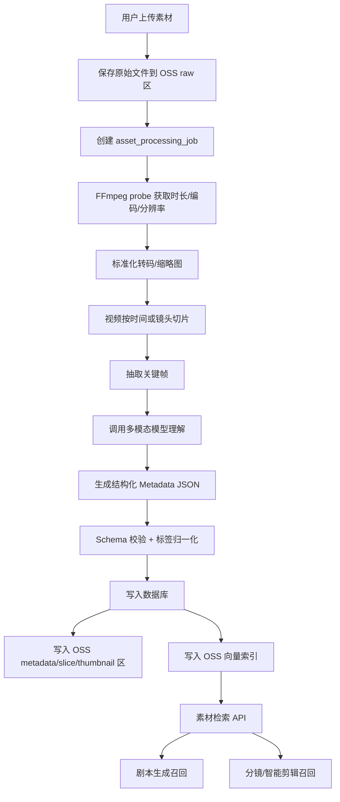
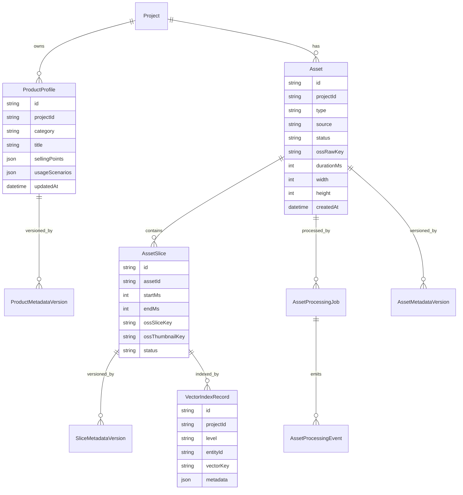
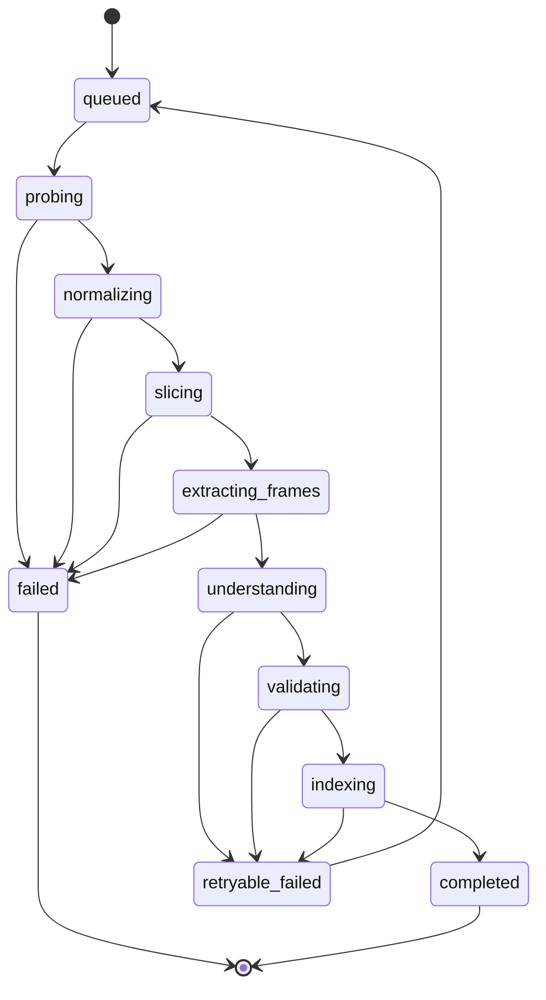

# Asset Import And Multi-Granularity Metadata Design

## Document Status

- Project: `shopclip-ai`
- Date: 2026-05-24
- Owner Agent: `solution-architect`
- Related requirement: 素材模块 P0/P1, especially "素材导入", "多颗粒度结构化", "素材检索"
- Status: Draft for implementation
- Scope: 素材导入、媒体处理、多模态理解、结构化 Metadata、OSS/向量检索存储、下游召回接口

## Official Tencent Cloud COS / MetaInsight References

All future implementation work for the material library storage, metadata indexing, and vector retrieval path must check these official Tencent Cloud documents first. If the Tencent Cloud document IDs change, search the COS document center by the listed API or feature name and update this section before changing implementation code.

### COS Bucket And SDK References

- COS API overview: https://cloud.tencent.com/document/product/436/7751
- SDK overview: https://cloud.tencent.com/document/product/436/6474
- Common request parameters: https://cloud.tencent.com/document/product/436/7728

### MetaInsight Dataset And File Index References

- MetaInsight / intelligent retrieval overview: https://cloud.tencent.com/document/product/436/113336
- CreateDataset: https://cloud.tencent.com/document/product/436/106022
- DescribeDatasets: https://cloud.tencent.com/document/product/436/106023
- UpdateDataset: https://cloud.tencent.com/document/product/436/106024
- DeleteDataset: https://cloud.tencent.com/document/product/436/106025
- CreateFileMetaIndex: https://cloud.tencent.com/document/product/436/106026
- DescribeFileMetaIndex: https://cloud.tencent.com/document/product/436/106027
- DeleteFileMetaIndex: https://cloud.tencent.com/document/product/436/106028

### Vector Retrieval References

- Vector retrieval overview: https://cloud.tencent.com/document/product/436/113337
- Vector retrieval quick start: https://cloud.tencent.com/document/product/436/127709
- Python SDK examples for put/query vectors: https://cloud.tencent.com/document/product/436/127772

### Implementation Rule

- COS object identity is `bucket + region + objectKey`; the database must persist `objectKey` as the bridge from COS/MetaInsight search hits back to ShopClip asset metadata.
- Raw files, thumbnails, slices, metadata JSON, and vector records must use deterministic keys under the object layout defined in this document.
- MetaInsight file indexes and vector indexes are retrieval accelerators, not the source of truth. PostgreSQL remains the source of truth for workflow status, asset ownership, project binding, and business metadata.

## 1. Goal

本设计定义 ShopClip AI 的素材资产层。目标是让商家上传的商品图片、商品视频和参考素材，经过可复现的媒体处理和多模态理解后，形成商品级、视频级、slice 级三层结构化资产，并写入数据库、对象存储和向量检索索引，供剧本生成、分镜匹配和智能剪辑模块调用。

核心判断：

- 不自研底层向量数据库或 ANN 检索引擎，可以使用阿里云 OSS 向量检索作为检索底座。
- 不自研视觉识别模型或训练多模态模型，可以调用火山引擎/其他多模态模型完成理解与抽取。
- 必须自研素材处理流程、粒度模型、Schema、任务编排、质量控制、存储映射、检索 API 和下游消费逻辑。

## 2. Non-Goals

- 不在 P0/P1 内训练视觉模型、ASR 模型、OCR 模型或 Embedding 模型。
- 不在 P0/P1 内实现生产级版权检测、内容审核或电商平台真实商品库接入。
- 不把 OSS 向量检索包装成唯一创新点；它只承担向量存储和召回。
- 不把原始公开视频用于复刻、混剪或搬运；参考视频只保存结构化分析结果和来源声明。

## 3. End-To-End Flow



## 4. Responsibility Split

| Layer | Responsibility | Recommended Implementation |
| --- | --- | --- |
| 媒体处理 | 视频探测、转码、切片、抽帧、缩略图、音频提取 | FFmpeg, ffprobe, optional OpenCV |
| 多模态理解 | 图片/帧/片段摘要、商品主体、场景、动作、卖点、风格标签 | 火山引擎多模态模型或可替换 provider |
| 结构化资产建模 | 粒度定义、JSON Schema、字段校验、标签归一化、映射关系 | Node.js service + Zod schema |
| 存储 | 原始文件、切片文件、缩略图、metadata JSON、trace | OSS object storage + database |
| 向量检索 | Embedding 存储、语义召回、Metadata 过滤 | OSS vector search |
| 下游消费 | 按分镜需求召回素材、解释匹配原因、替换素材 | API service + editor UI |

## 5. Granularity Model

素材资产分为三层粒度。三层都可以被检索，但面向不同消费场景。

### 5.1 Product Level

商品级描述一组素材共同表达的商品事实，用于剧本生成和卖点约束。

Typical fields:

- `productId`
- `projectId`
- `category`
- `title`
- `sellingPoints`
- `targetAudience`
- `usageScenarios`
- `visualIdentity`
- `doNotMisrepresent`
- `sourceAssetIds`

Example:

```json
{
  "level": "product",
  "productId": "prod_001",
  "category": "portable blender",
  "sellingPoints": ["portable", "easy to clean", "fast blending"],
  "targetAudience": ["office workers", "fitness users"],
  "usageScenarios": ["kitchen", "office", "outdoor picnic"],
  "visualIdentity": {
    "colors": ["white", "transparent cup"],
    "materials": ["plastic", "stainless steel blade"],
    "shape": "compact cylindrical body"
  },
  "doNotMisrepresent": [
    "do not claim medical effect",
    "do not show unsafe blade contact"
  ]
}
```

### 5.2 Asset Level

文件级描述单个图片或视频文件的整体信息，用于素材库展示、过滤和视频整体匹配。

Typical fields:

- `assetId`
- `projectId`
- `type`: `image | video | reference_video | audio`
- `source`: `merchant_upload | public_reference | generated | external_provider`
- `sourceDeclaration`
- `ossRawKey`
- `durationMs`
- `width`
- `height`
- `format`
- `overallSummary`
- `globalTags`
- `embeddingText`
- `status`

Example:

```json
{
  "level": "asset",
  "assetId": "asset_001",
  "type": "video",
  "source": "merchant_upload",
  "sourceDeclaration": "merchant owned product demo video",
  "ossRawKey": "projects/shopclip-ai/raw/project_001/asset_001/source.mp4",
  "durationMs": 12800,
  "width": 1080,
  "height": 1920,
  "overallSummary": "A short kitchen demo showing a portable blender crushing fruit and being rinsed clean.",
  "globalTags": ["product demo", "kitchen", "close-up", "clean lifestyle"],
  "embeddingText": "portable blender product demo kitchen close-up fruit blending easy cleaning"
}
```

### 5.3 Slice Level

切片级是智能剪辑最重要的粒度。一个 slice 通常是 1.5-3 秒的视频片段，或一张图片的局部/整体分析结果。

Typical fields:

- `sliceId`
- `assetId`
- `projectId`
- `startMs`
- `endMs`
- `ossSliceKey`
- `ossThumbnailKey`
- `representativeFrameKeys`
- `summary`
- `productVisibility`
- `visibleParts`
- `scene`
- `action`
- `camera`
- `composition`
- `ocrText`
- `asrText`
- `creativeTags`
- `suitableShotTypes`
- `qualitySignals`
- `embeddingText`

Example:

```json
{
  "level": "slice",
  "sliceId": "slice_asset_001_003",
  "assetId": "asset_001",
  "startMs": 6000,
  "endMs": 8500,
  "summary": "Close-up of the transparent cup showing fruit being blended into a smoothie.",
  "productVisibility": "clear",
  "visibleParts": ["cup body", "blade base", "lid"],
  "scene": {
    "location": "kitchen counter",
    "lighting": "bright natural light",
    "style": "clean lifestyle demo"
  },
  "action": "fruit blending",
  "camera": {
    "shotType": "close-up",
    "movement": "static",
    "angle": "front"
  },
  "ocrText": "",
  "asrText": "",
  "creativeTags": ["usage demo", "texture", "healthy lifestyle", "product close-up"],
  "suitableShotTypes": ["feature demonstration", "proof shot", "usage scenario"],
  "qualitySignals": {
    "sharpness": "high",
    "productOcclusion": "low",
    "usableForAd": true
  },
  "embeddingText": "close-up portable blender cup fruit blending smoothie kitchen clean lifestyle proof shot"
}
```

## 6. Data Model

建议新增或扩展以下实体。当前 demo 可先使用 in-memory store，正式实现时迁移到 PostgreSQL/Prisma。



## 7. OSS Object Layout

Use deterministic object keys so every generated artifact can be traced back to source.

```text
oss://<bucket>/
  projects/<projectId>/
    raw/
      <assetId>/source.<ext>
    normalized/
      <assetId>/source-normalized.mp4
    thumbnails/
      <assetId>/cover.jpg
      <assetId>/<sliceId>.jpg
    slices/
      <assetId>/<sliceId>.mp4
    frames/
      <assetId>/<sliceId>/frame-0001.jpg
      <assetId>/<sliceId>/frame-0002.jpg
    metadata/
      product/<productId>/latest.json
      assets/<assetId>/latest.json
      slices/<sliceId>/latest.json
    traces/
      jobs/<jobId>.jsonl
```

Storage rules:

- `raw/` objects are immutable after upload.
- `normalized/`, `slices/`, `frames/`, `thumbnails/` may be regenerated, but regeneration must create a new metadata version.
- `metadata/*/latest.json` is a convenience pointer; database remains the source of truth for workflow status.
- Every public or external reference asset must include `sourceDeclaration`.

## 8. Vector Index Design

OSS vector search stores vectors plus metadata. It should not be treated as the source of truth for full business records.

### 8.1 Vector Key Convention

```text
project:<projectId>:product:<productId>
project:<projectId>:asset:<assetId>
project:<projectId>:slice:<sliceId>
```

### 8.2 Vector Metadata

Every vector record should include enough metadata to filter and trace the hit.

```json
{
  "projectId": "project_001",
  "level": "slice",
  "entityId": "slice_asset_001_003",
  "assetId": "asset_001",
  "source": "merchant_upload",
  "assetType": "video",
  "startMs": 6000,
  "endMs": 8500,
  "tags": ["usage demo", "product close-up"],
  "category": "portable blender",
  "suitableShotTypes": ["feature demonstration", "proof shot"],
  "productVisibility": "clear",
  "ossThumbnailKey": "projects/project_001/thumbnails/asset_001/slice_asset_001_003.jpg"
}
```

### 8.3 Embedding Text Rules

Do not embed raw JSON directly. Generate a concise, stable text projection:

```text
portable blender | product close-up | fruit blending | kitchen counter | clear product visibility | feature demonstration | clean lifestyle demo
```

Embedding text should include:

- Product category and normalized product name
- Scene and action
- Visible product parts
- Shot type and camera movement
- Creative tags
- Suitable shot types
- OCR/ASR snippets if useful and safe

## 9. Processing Job Lifecycle



Job status fields:

- `status`: `queued | running | retryable_failed | failed | completed`
- `currentStep`: `probe | normalize | slice | extract_frames | understand | validate | index`
- `progress`: integer 0-100
- `attemptCount`
- `lastErrorCode`
- `lastErrorMessage`
- `traceEventIds`

Retry policy:

- Media processing failures caused by invalid files are terminal.
- Model timeout/rate-limit/schema mismatch failures are retryable.
- Vector indexing failures are retryable and should not require re-running FFmpeg.

## 10. API Design

### 10.1 Upload Asset

`POST /api/projects/:projectId/assets`

Request:

```json
{
  "type": "video",
  "source": "merchant_upload",
  "sourceDeclaration": "merchant owned product demo video",
  "fileName": "blender-demo.mp4"
}
```

Response:

```json
{
  "assetId": "asset_001",
  "status": "uploaded",
  "processingJobId": "job_001"
}
```

### 10.2 Start Or Retry Processing

`POST /api/assets/:assetId/process`

Request:

```json
{
  "mode": "full",
  "forceRegenerate": false
}
```

Response:

```json
{
  "jobId": "job_001",
  "status": "queued"
}
```

### 10.3 Get Processing Job

`GET /api/asset-processing-jobs/:jobId`

Response:

```json
{
  "jobId": "job_001",
  "assetId": "asset_001",
  "status": "running",
  "currentStep": "understand",
  "progress": 68,
  "trace": [
    {
      "time": "2026-05-24T10:20:30.000Z",
      "step": "slicing",
      "status": "completed",
      "message": "Generated 5 slices"
    }
  ]
}
```

### 10.4 Search Assets

`GET /api/assets/search?projectId=project_001&q=fruit%20blending&level=slice&shotType=feature%20demonstration`

Response:

```json
{
  "query": "fruit blending",
  "results": [
    {
      "level": "slice",
      "entityId": "slice_asset_001_003",
      "assetId": "asset_001",
      "score": 0.91,
      "reason": "Matches feature demonstration, fruit blending action, and clear product close-up.",
      "thumbnailUrl": "/api/assets/asset_001/slices/slice_asset_001_003/thumbnail",
      "startMs": 6000,
      "endMs": 8500,
      "tags": ["usage demo", "product close-up"]
    }
  ]
}
```

### 10.5 Recall For Scene

`POST /api/scenes/:sceneId/asset-recall`

Request:

```json
{
  "visualPrompt": "Close-up shot of the blender crushing fruit, bright kitchen style",
  "requiredShotType": "feature demonstration",
  "durationMs": 2500,
  "constraints": {
    "productVisibility": "clear",
    "avoidTags": ["unsafe", "blurry"]
  }
}
```

Response:

```json
{
  "sceneId": "scene_001",
  "candidates": [
    {
      "sliceId": "slice_asset_001_003",
      "assetId": "asset_001",
      "score": 0.91,
      "fit": {
        "durationFit": "good",
        "semanticFit": "high",
        "qualityFit": "high"
      },
      "reason": "The slice shows a close-up blending action with clear product visibility."
    }
  ]
}
```

## 11. Model Prompt Contract

The model must be asked for strict JSON. Do not let free-form prose become the persistent source of truth.

### 11.1 Slice Understanding Prompt Shape

Input:

- Product brief
- Asset metadata
- Slice start/end time
- 1-3 representative frame images
- Optional OCR/ASR text

Output schema:

```json
{
  "summary": "string",
  "productVisibility": "clear | partial | none | uncertain",
  "visibleParts": ["string"],
  "scene": {
    "location": "string",
    "lighting": "string",
    "style": "string"
  },
  "action": "string",
  "camera": {
    "shotType": "close-up | medium | wide | detail | pov | other",
    "movement": "static | pan | tilt | zoom | handheld | other",
    "angle": "front | side | top | low | high | other"
  },
  "creativeTags": ["string"],
  "suitableShotTypes": ["hook | feature demonstration | proof shot | lifestyle scene | transition | ending"],
  "qualitySignals": {
    "sharpness": "high | medium | low",
    "productOcclusion": "low | medium | high",
    "usableForAd": true
  },
  "embeddingText": "string"
}
```

Validation rules:

- Reject output if JSON cannot parse.
- Reject output if required enum values are outside allowed values.
- Cap tag count to 12 per slice.
- Normalize tags to lowercase English slugs for search, but keep display labels separately when needed.
- If model confidence is low, mark `status = needs_review` instead of silently accepting.

## 12. Quality Controls

Minimum quality checks:

- File type whitelist: image and video formats only for this module.
- File size limit and duration limit must be enforced before FFmpeg work starts.
- Slice duration target: 1.5-3 seconds for normal video; never create slices shorter than 800 ms unless source is shorter.
- Representative frame count: 1 for P0, 3 for P1.
- A slice is eligible for auto-editing only when `qualitySignals.usableForAd = true`.
- A slice with `productVisibility = none` can be used as transition/lifestyle background, but not as a product proof shot.
- Every AI-generated metadata object stores `modelProvider`, `modelName`, `promptVersion`, and `createdAt`.

## 13. Downstream Consumption

### 13.1 Script Generation

Script generation consumes:

- Product-level metadata for factual constraints and selling points.
- Asset-level summaries to understand available visual material.
- Optional top slice tags to avoid asking for impossible shots.

Example:

> If no slice shows outdoor usage, the script should not require an outdoor usage scene unless it plans to generate new footage.

### 13.2 Storyboard Generation

Storyboard generation consumes:

- Product-level selling points
- Slice-level available shot types
- Creative tags and visual styles

Each generated scene should include an `assetRecallQuery`:

```json
{
  "sceneId": "scene_001",
  "assetRecallQuery": {
    "query": "close-up fruit blending portable blender clear product visibility",
    "requiredShotType": "feature demonstration",
    "durationMs": 2500
  }
}
```

### 13.3 Smart Editing

Smart editing consumes slice-level candidates and picks the best match by:

- Semantic score from vector search
- Duration fit
- Product visibility
- Quality signals
- Source preference: merchant-owned assets before external/generated assets
- Compliance flags

## 14. P0/P1/P2 Scope

### P0

- Upload image/video metadata and raw file.
- Save raw file to object storage or local fallback storage.
- Use FFmpeg to probe media.
- For video, fixed 3-second slicing and 1 representative frame per slice.
- Use mock or real model provider to generate asset/slice JSON.
- Store metadata in database/in-memory store.
- Basic keyword/tag search.
- Expose processing progress in UI.

### P1

- Store raw/slice/frame/metadata assets in OSS with deterministic keys.
- Generate Embedding text and write vectors to OSS vector search.
- Support keyword + tag + vector hybrid search.
- Add scene-level asset recall endpoint.
- Add retryable processing jobs and trace events.
- Add model output validation and `needs_review` status.

### P2

- Scene boundary detection instead of only fixed interval slicing.
- OCR/ASR integration.
- Multi-language metadata and dubbing alignment.
- Human review queue for uncertain model outputs.
- Attribution dashboard: `creative factor -> slice usage -> mock conversion result`.
- Compliance audit flow for source declaration and generated claims.

## 15. Implementation Notes

Recommended backend modules:

```text
apps/api/src/modules/assets/
  assetRoutes.ts
  assetService.ts
  assetProcessingService.ts
  assetSearchService.ts
  assetRecallService.ts

apps/api/src/modules/media/
  ffmpegProbe.ts
  ffmpegSlice.ts
  frameExtractor.ts

apps/api/src/providers/storage/
  storageProvider.ts
  localStorageProvider.ts
  ossStorageProvider.ts

apps/api/src/providers/vector/
  vectorProvider.ts
  mockVectorProvider.ts
  ossVectorProvider.ts

apps/api/src/providers/vision/
  visionUnderstandingProvider.ts
  mockVisionUnderstandingProvider.ts
  arkVisionUnderstandingProvider.ts
```

Recommended shared schemas:

```text
packages/shared/src/asset-metadata.schema.ts
packages/shared/src/asset-processing.schema.ts
packages/shared/src/asset-search.schema.ts
```

Security rules:

- Never expose model API keys, OSS credentials, endpoint IDs, or bucket credentials to the browser.
- Do not write real secrets into README, screenshots, seed data, fixtures, tests, or trace events.
- Environment variables must be server-side only unless explicitly prefixed for public frontend config.

## 16. Acceptance Criteria

The feature is complete when:

- Uploading a product video creates an asset record and a processing job.
- The processing job creates at least one slice and one thumbnail for a valid video.
- Each asset and slice has structured metadata matching the shared schema.
- Search can return slice-level results by keyword/tag.
- Vector provider can be swapped between mock and OSS without changing route contracts.
- A storyboard scene can request asset recall and receive ranked slice candidates with reasons.
- Failure states are visible and retryable when caused by model or indexing errors.
- No credentials are present in repository files or frontend bundles.
- Evidence is recorded under `projects/shopclip-ai/evidence/` when implemented.

## 17. Open Decisions

- Production storage target is Tencent Cloud COS. Future storage/indexing work must reference the official Tencent Cloud COS / MetaInsight links recorded near the top of this document.
- Which exact Tencent Cloud MetaInsight and vector retrieval API shape will be used in production after credentials and service authorization are confirmed.
- Which multimodal model will be the first real provider for frame/slice understanding.
- Whether ASR/OCR are included in P1 or deferred to P2.
- Whether metadata review UI is required before slice metadata can be consumed by smart editing.
