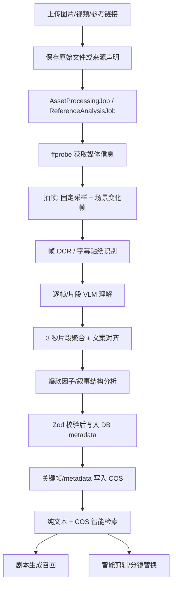

# Part 015 - 多颗粒度素材结构化、爆款视频拆解与智能剪辑计划

> **For agentic workers:** REQUIRED SUB-SKILL: Use `superpowers:subagent-driven-development` or `superpowers:executing-plans` to implement this plan task-by-task. Steps use checkbox (`- [ ]`) syntax for tracking.

**Goal:** 将 ShopClip AI 的素材库从“上传文件 + 简单标签”升级为可被剧本生成、爆款仿写、分镜召回和智能剪辑消费的多颗粒度结构化资产层。

**Architecture:** 在现有 React + Node.js + TypeScript 单仓库内实现。PostgreSQL/Prisma 是业务事实源；腾讯云 COS/MetaInsight 仅作为对象存储与智能检索加速层；火山引擎/可替换多模态模型负责图片、帧和片段理解。

**Tech Stack:** React、Node.js、TypeScript、Zod、Prisma、PostgreSQL、FFmpeg/ffprobe、火山引擎多模态/文本模型、腾讯云 COS 智能检索、Vitest、Playwright。

---

## 1. 文档状态

- 项目：`shopclip-ai`
- 创建日期：2026-05-29
- Owner Agent：`solution-architect`
- 关联需求：素材多颗粒度结构化、素材检索、优质视频库、爆款仿写、灵感模板、智能剪辑
- 状态：Implemented MVP / Verified
- 前置依据：
  - `projects/shopclip-ai/00-requirements.md`
  - `projects/shopclip-ai/01-design-spec.md`
  - `projects/shopclip-ai/02-development-plan.md`
  - `projects/shopclip-ai/decisions/2026-05-24-asset-multigranularity-structure-design.md`

实施证据：`projects/shopclip-ai/evidence/part-015-multigranularity-asset-and-viral-analysis-2026-05-29.md`

MVP 完成说明：

- 已完成素材结构化 schema、Prisma/store 扩展、素材处理 job、mock/Ark provider 边界、混合检索、参考视频拆解、模板提炼、剧本生成接入和 Studio 分镜素材召回。
- 真实媒体处理已落地：视频素材通过 ffprobe 读取时长/分辨率，通过 ffmpeg 抽取真实关键帧；视频字幕、贴纸和商品标签默认通过视觉模型 OCR 写入 `ocrText`。ASR 仅作为显式 `ASR_PROVIDER_MODE=http/real` 的可选增强，默认不抽音频、不伪造 transcript。
- 真实火山/Ark 多模态视觉理解已接入环境配置驱动的 provider wrapper；业务默认 `VISION_PROVIDER_MODE=ark`/real 需要真实 key 与模型，缺配置或模型失败会直接报错。只有显式 `VISION_PROVIDER_MODE=mock` 才走 deterministic fixture。COS 智能检索和公开视频站外搜索仍按 provider/config 形式接入。
- 真实火山/Ark 参考视频拆解已接入环境配置驱动的 provider wrapper；业务默认 `REFERENCE_PROVIDER_MODE=ark`/real 需要真实 key 与模型，缺配置会直接报错。只有显式 `REFERENCE_PROVIDER_MODE=mock` 才走 deterministic fixture。
- 公开视频主动拆解已按“分析型下载”接入：用户只提供 `sourceUrl` 时，后端通过 `ReferenceDownloadProvider` 创建 `source=public_reference` 的视频资产，复用素材处理链路生成结构化 slice，再把结构化上下文提供给爆款拆解 provider。默认 downloader 为真实 HTTP 直链下载；只有显式 `REFERENCE_DOWNLOAD_PROVIDER_MODE=mock` 才返回 fixture。平台短链后续可接 `yt-dlp` 或托管下载服务。
- 自有参考视频已通过 `sourceAssetId` 接入：商家先上传视频素材，再在灵感分区的参考视频拆解面板选择该视频，后端复用素材处理链路生成结构化 slice 后再跑爆款拆解；前端拆解完成后刷新项目快照，保证创作分区和 Studio 能消费最新结构化素材。公开视频资产仍禁止进入最终成片混剪候选，只用于分析、模板和剧本参考。
- 2026-05-30 生产 504 修复：`POST /api/references/analyze` 已从同步长请求改为异步分析任务。接口只做参数校验与 `ReferenceVideo(status=analyzing)` 注册并立即返回 `202`；后台继续执行公开视频下载、COS 入库、ffprobe/ffmpeg 切片、视觉理解和爆款拆解，成功后更新为 `ready`，失败后写入 `failed + errorMessage`。前端灵感分区会轮询参考库，只有 `ready` 的参考视频才能加入剧本素材库或提炼模板。

## 2. 指定 GitHub 仓库代码调研结论

本 Part 的视频拆解设计参考用户指定的两个仓库，但不直接照搬其技术栈和业务边界。

### 2.1 `pelpeljakob-creator/viral-video-analyzer`

本地调研路径：`output/research/viral-video-analyzer`
GitHub：`https://github.com/pelpeljakob-creator/viral-video-analyzer`

代码级结论：

- `backend/services/pipeline.py` 是核心参考。它把分析任务拆成 `downloading`、`extracting`、`transcribing`、`analyzing_frames`、`generating_prompts`、`viral_analysis` 六阶段，并通过 `asyncio.Queue` 向 SSE 输出进度。ShopClip 应迁移这个阶段模型到 `AssetProcessingJob` 和 `ReferenceAnalysisJob`，并复用当前 trace 思路。
- `backend/services/video_processor.py` 使用 `ffprobe` 获取时长，使用 `ffmpeg` 抽音频，按 `fps=1/3` 抽帧，并用 `select='gt(scene,0.3)'` 补充场景变化帧。ShopClip MVP 采用同样的“固定采样 + 场景变化采样”，后续再升级重型镜头检测。
- `backend/services/vision_analyzer.py` 的 `FRAME_ANALYSIS_SYSTEM` 将单帧拆成 `shot_type`、`camera_movement`、`composition`、`transition`、`text_overlay`、`visual_description`、`mood`、`key_elements`。这些字段直接进入 ShopClip slice 级 metadata。
- `backend/services/vision_analyzer.py` 的 `SEGMENT_PROMPT_SYSTEM` 生成 `visual`、`copywriting`、`recreation` 三类提示词。ShopClip 映射为 `visualPrompt`、`copywritingPrompt`、`shootingGuide`，供剧本仿写和分镜重生成使用。
- `backend/services/viral_analyzer.py` 输出 `hook_score`、`hook_analysis`、`pacing_analysis`、`emotional_arc`、`key_viral_factors`、`target_audience`、`content_formula`、`recreation_blueprint`，适合作为“优质视频库结构化拆解报告”的基础字段。
- `backend/models/schemas.py` 的 `VideoMeta`、`TranscriptSegment`、`FrameAnalysis`、`SegmentAnalysis`、`ViralAnalysis`、`FullAnalysisResult` 需要用 Zod 在 `packages/shared` 中重建，并补充电商字段、来源声明和合规字段。
- `frontend/src/components/ProgressStream.tsx`、`SegmentCard.tsx`、`TimelineView.tsx` 展示了长任务进度、逐秒拆解、按片段展开帧分析的交互形态。ShopClip 只复用信息结构，UI 合并到现有素材库/Studio。

不直接采用：

- 该项目主链路针对抖音 URL 下载与本地 `result.json`，没有 ShopClip 的素材库、项目绑定、COS objectKey、Prisma 持久化。
- 该项目是 FastAPI/Python。ShopClip 当前主栈是 Node/TypeScript，不新增 Python 主服务。
- 公开视频下载逻辑存在平台合规和稳定性风险。ShopClip MVP 只保存公开视频结构化分析与来源声明，不复刻、不混剪原视频。

### 2.2 `chongchonghaoman/ViralX`

本地调研路径：`output/research/ViralX`
GitHub：`https://github.com/chongchonghaoman/ViralX`

代码级结论：

- `tiktok_viral_analyzer.py` 体现“关键词搜索 -> min_likes 过滤 -> 提取 title/author/likes/comments/shares/views/cover -> 评论抓取”的优质视频库入口。ShopClip 可复用实体设计，但 MVP 以用户上传/录入来源为主，自动站外搜索作为 provider。
- `ai_analyzer.py` 的 `analyze_video_script()` 是最有价值的电商拆解 prompt。它要求输出核心卖点、视听语言、用户反馈洞察和 9 段叙事结构：Hook、Pain、Fear、Solution、Demo、Trust、Price、CTA、Closure。ShopClip 必须将其改造成严格 JSON schema，而不是 Markdown 文本。
- `ai_analyzer.py` 的 4 大转化钩子可沉淀为创作因子：复购声明、口语自我纠正、价格悬念、身份标签。
- `ai_analyzer.py` 的 `generate_viral_variants()` 提供裂变策略：换身份标签、换使用场景、换价格锚定参照物、换语言/文化背景。ShopClip 可作为 P2 的 A/B 出片与多语言变体入口。
- `report_generator.py` 做轻量统计：总点赞、总评论、平均点赞、标题关键词、作者频次。ShopClip 可用作优质视频库排序/筛选指标。
- `web_app.py` 支持缓存优先、实时刷新、查看 AI 深度拆解、生成变体。ShopClip 可复用“缓存优先 + 手动刷新 + 报告详情”的产品模式。

不直接采用：

- `AIAnalyzer.analyze_video_script()` 返回 Markdown，字段不稳定。ShopClip 的模型输出必须是 JSON，并通过 Zod 校验。
- TikTok/RapidAPI 示例 API 可用性不稳定，不能作为评审 Demo 的唯一链路。
- Flask 单页界面不并入 ShopClip 前端。

## 3. 核心产品判断

### 3.1 图片也要结构化

图片原图可直接作为图生视频参考，但结构化仍然有价值：

- 剧本生成需要知道图片角色：主图、细节图、包装图、场景图、对比图。
- 分镜召回需要判断图片是否适合 Hook、卖点证明、使用演示、CTA 或品牌收尾。
- 智能剪辑需要知道商品主体是否清晰、是否有手部/人物/场景、是否能作为 proof shot。
- 合规需要记录来源、版权声明、OCR 文案和可能的夸大功效风险。
- 关键词检索不能只靠文件名；图片中的 OCR、场景、颜色、材质和卖点都应可搜索。

### 3.2 视频结构化是智能剪辑关键

视频需要拆成四层：

- 文件级：整体摘要、风格、时长、分辨率、音频、来源、统计数据。
- 时间片段级：每 2-3 秒或场景变化切片，记录画面、动作、台词、字幕、运镜、转场、情绪、质量。
- 创意结构级：Hook、Pain、Demo、Trust、CTA 等叙事段落。
- 转化因子级：身份标签、价格锚定、信任证明、口语化真实感、评论痛点。

### 3.3 检索采用“纯文本 + COS 智能检索”

当前不建议自建向量数据库。原因是项目重点是业务链路，自建向量库会增加部署、迁移、运维和一致性成本。已有 `apps/api/src/providers/assets/cosIntelligentSearchProvider.ts` 可以通过 COS objectKey 命中数据库资产。

目标策略：

- 纯文本匹配：默认 fallback，按 `name/tags/embeddingText/metadata.searchText/slice.label/slice.tags` 做加权打分。
- COS 智能检索：用于图片和关键帧级语义召回，返回 objectKey/URI/score，再通过 `objectKey -> assetId/sliceId` 映射回数据库结构化对象。
- 数据库是事实源。COS 返回结果只能作为候选，最终结果必须回表读取结构化 metadata。

## 4. 多颗粒度结构化字段设计

### 4.1 Product Level：商品事实层

消费方：剧本生成、合规约束、分镜画面一致性。

字段：

- `productName`
- `category`
- `targetAudience`
- `sellingPoints`
- `usageScenarios`
- `visualIdentity.colors`
- `visualIdentity.materials`
- `visualIdentity.shape`
- `visualIdentity.logoText`
- `visualIdentity.packaging`
- `doNotMisrepresent`
- `sourceAssetIds`
- `confidence`

### 4.2 Asset Level：素材文件层

消费方：素材库展示、筛选、搜索、剧本可用素材摘要。

字段：

- `assetId`
- `projectId?`
- `type`: `image | video | reference`
- `source`: `merchant_upload | public_reference | generated | external_provider`
- `sourceDeclaration`
- `objectKey`
- `thumbnailKey`
- `durationSeconds?`
- `width?`
- `height?`
- `format?`
- `overallSummary`
- `role`: `hero_image | detail_image | packaging | usage_demo | lifestyle | reference_video | transition | brand_doc`
- `globalTags`
- `ocrText`
- `asrSummary`
- `visualStyle`
- `qualitySignals`
- `complianceFlags`
- `searchText`
- `embeddingText`
- `modelTrace`

### 4.3 Slice Level：视频切片/图片镜头层

消费方：智能剪辑、分镜素材召回、时间轴、局部替换。

字段：

- `sliceId`
- `assetId`
- `startSecond`
- `endSecond`
- `thumbnailKey`
- `frameKeys`
- `summary`
- `transcript`
- `ocrText`
- `shotType`
- `cameraMovement`
- `composition`
- `transition`
- `mood`
- `action`
- `keyElements`
- `productVisibility`: `clear | partial | none | uncertain`
- `visibleProductParts`
- `suitableSceneRoles`: `hook | pain | solution | demo | trust | price | cta | closure | transition`
- `qualitySignals.sharpness`
- `qualitySignals.stability`
- `qualitySignals.usableForAd`
- `searchText`
- `embeddingText`
- `cosFrameObjectKeys`

### 4.4 Reference Video Level：爆款拆解层

消费方：优质视频库、爆款仿写、模板提炼、变体生成。

字段：

- `referenceId`
- `sourceUrl`
- `sourcePlatform`
- `sourceDeclaration`
- `title`
- `author`
- `publicStats.likes`
- `publicStats.comments`
- `publicStats.shares`
- `publicStats.views`
- `durationSeconds`
- `category`
- `hookScore`
- `hookAnalysis`
- `pacingAnalysis`
- `emotionalArc`
- `targetAudience`
- `contentFormula`
- `keyViralFactors`
- `commerceNarrativeSegments`
- `recreationBlueprint`
- `commentInsights`
- `derivedTemplates`

### 4.5 Viral Template Level：灵感模板层

消费方：模板选择、剧本生成、多风格变体。

字段：

- `templateId`
- `name`
- `category`
- `strategy`
- `factorSet`
- `narrativeStructure`
- `shotRequirements`
- `copywritingRules`
- `riskRules`
- `sourceReferenceIds`

## 5. 目标数据流



## 6. 文件结构计划

### 6.1 共享 schema

- Modify: `packages/shared/src/schemas.ts`
- Create: `packages/shared/src/assetStructure.test.ts`

新增 schema：

- `ProductProfileSchema`
- `StructuredAssetMetadataSchema`
- `StructuredSliceMetadataSchema`
- `ReferenceVideoAnalysisSchema`
- `ViralTemplateSchema`

### 6.2 Prisma 数据模型

- Modify: `apps/api/prisma/schema.prisma`
- Modify: `apps/api/src/modules/projects/prismaProjectStore.ts`
- Modify: `apps/api/src/modules/projects/memoryStore.ts`
- Modify: `apps/api/src/modules/projects/projectStore.ts`

第一阶段优先复用 `Asset.metadata` JSON，减少迁移风险；`AssetSlice` 需要补充 `thumbnailKey`、`metadata`、`embeddingText`。新增 `ReferenceVideo`、`ReferenceVideoSegment`、`ViralTemplate`、`AssetProcessingEvent`。

### 6.3 媒体处理与视觉理解

- Create: `apps/api/src/modules/media/mediaProbe.ts`
- Create: `apps/api/src/modules/media/frameSampler.ts`
- Create: `apps/api/src/modules/media/audioExtractor.ts`
- Create: `apps/api/src/modules/assets/assetProcessingService.ts`
- Create: `apps/api/src/providers/vision/visionUnderstandingProvider.ts`
- Create: `apps/api/src/providers/vision/mockVisionUnderstandingProvider.ts`
- Create: `apps/api/src/providers/vision/arkVisionUnderstandingProvider.ts`

### 6.4 混合检索

- Modify: `apps/api/src/modules/retrieval/search.ts`
- Create: `apps/api/src/modules/retrieval/hybridAssetSearch.ts`
- Modify: `apps/api/src/providers/assets/cosIntelligentSearchProvider.ts`

### 6.5 爆款视频拆解

- Create: `apps/api/src/modules/references/referenceAnalysisService.ts`
- Create: `apps/api/src/modules/references/referenceTemplateService.ts`
- Create: `apps/api/src/providers/references/viralBreakdownProvider.ts`
- Create: `apps/api/src/providers/references/mockViralBreakdownProvider.ts`
- Create: `apps/api/src/providers/references/arkViralBreakdownProvider.ts`
- Modify: `apps/api/src/modules/projects/router.ts`

### 6.6 前端

- Modify: `apps/web/src/features/assets/AssetsPanel.tsx`
- Modify: `apps/web/src/features/script/ScriptPanel.tsx`
- Modify: `apps/web/src/features/studio/StudioWorkspace.tsx`
- Create: `apps/web/src/features/references/ReferenceLibraryPanel.tsx`
- Create: `apps/web/src/features/references/ReferenceBreakdownView.tsx`
- Modify: `apps/web/src/lib/api.ts`
- Modify: `apps/web/src/app/App.tsx`

## 7. API 计划

### 7.1 素材处理

`POST /api/assets/:assetId/process`

```json
{
  "mode": "full",
  "forceRegenerate": false
}
```

返回：

```json
{
  "jobId": "asset_job_001",
  "assetId": "asset_001",
  "status": "processing",
  "currentStep": "probe",
  "progress": 5
}
```

`GET /api/asset-processing-jobs/:jobId`

```json
{
  "jobId": "asset_job_001",
  "assetId": "asset_001",
  "status": "ready",
  "currentStep": "index",
  "progress": 100,
  "events": [
    {
      "step": "frame-sampling",
      "status": "completed",
      "message": "Sampled 5 frames and 3 scene-change frames."
    }
  ]
}
```

### 7.2 混合检索

`GET /api/assets/search?q=close-up%20demo&level=slice&sceneRole=demo&projectId=<id>`

结果必须包含 asset、slice、score 和 reasons，reasons 需要暴露 `text:*`、`role:*`、`cos-score:*` 等解释信息。

### 7.3 参考视频拆解

`POST /api/references/analyze`

```json
{
  "sourceUrl": "https://www.tiktok.com/@creator/video/123",
  "sourcePlatform": "tiktok",
  "sourceDeclaration": "public reference URL; save analysis only",
  "category": "portable blender",
  "title": "creator-provided reference"
}
```

`POST /api/references/templates`

```json
{
  "referenceIds": ["ref_001", "ref_002", "ref_003"],
  "category": "portable blender",
  "templateName": "Identity Hook + Fast Demo"
}
```

## 8. 实施任务

### Task 015.1：共享结构化 schema

**Files:**

- Modify: `packages/shared/src/schemas.ts`
- Create: `packages/shared/src/assetStructure.test.ts`

- [x] 增加 Product、Asset、Slice、ReferenceVideo、ViralTemplate metadata schema。
- [x] 保持现有 `AssetMetadataSchema.metadata` 向后兼容。
- [x] 添加图片、视频 slice、参考视频拆解三个解析测试。
- [x] 运行 `corepack pnpm --filter @shopclip/shared test`。

### Task 015.2：Prisma 与 Store 扩展

**Files:**

- Modify: `apps/api/prisma/schema.prisma`
- Modify: `apps/api/src/modules/projects/projectStore.ts`
- Modify: `apps/api/src/modules/projects/memoryStore.ts`
- Modify: `apps/api/src/modules/projects/prismaProjectStore.ts`

- [x] 为 `AssetSlice` 增加缩略图、metadata、embeddingText。
- [x] 新增 `ReferenceVideo`、`ReferenceVideoSegment`、`ViralTemplate`、`AssetProcessingEvent`。
- [x] Store 增加 `addAssetSlices`、`updateAssetSlice`、`addReferenceVideo`、`updateReferenceVideoAnalysis`、`listReferenceVideos`、`addViralTemplate`。
- [x] 内存 Store 与 Prisma Store 行为保持一致。
- [x] 运行 `corepack pnpm --filter @shopclip/api test`。

### Task 015.3：素材处理 job

**Files:**

- Create: `apps/api/src/modules/assets/assetProcessingService.ts`
- Create: `apps/api/src/modules/media/mediaProbe.ts`
- Create: `apps/api/src/modules/media/frameSampler.ts`
- Create: `apps/api/src/modules/media/audioExtractor.ts`
- Modify: `apps/api/src/modules/projects/router.ts`

- [x] 实现步骤：`probe`、`sample_frames`、`prepare_ocr`、`understand`、`persist_metadata`、`index`；只有显式 ASR 模式才使用 `extract_audio`。
- [x] 图片资产创建一个 synthetic slice。
- [x] 视频资产按 3 秒切片，并补充场景变化帧。
- [x] 处理进度写入 `AssetProcessingEvent`。
- [x] 无效文件失败为 terminal；模型超时和索引失败为 retryable。

### Task 015.4：视觉理解 provider

**Files:**

- Create: `apps/api/src/providers/vision/visionUnderstandingProvider.ts`
- Create: `apps/api/src/providers/vision/mockVisionUnderstandingProvider.ts`
- Create: `apps/api/src/providers/vision/arkVisionUnderstandingProvider.ts`

- [x] provider 输出必须匹配 shared schema。
- [x] mock provider 根据文件名、tags、slice 时间生成确定性 metadata。
- [x] Ark provider 只读服务端环境变量，不暴露 secret；素材处理默认接入 Ark wrapper，未配置或模型失败时显式报错，只有显式 mock 模式才使用 deterministic fixture。
- [x] Prompt 字段包含 shot type、camera movement、composition、transition、text overlay、visual description、mood、key elements。
- [x] 模型输出不合法时写入 `needs_review`，不阻塞整条任务。

### Task 015.5：混合检索

**Files:**

- Modify: `apps/api/src/modules/retrieval/search.ts`
- Create: `apps/api/src/modules/retrieval/hybridAssetSearch.ts`
- Modify: `apps/api/src/providers/assets/cosIntelligentSearchProvider.ts`

- [x] 拆分为 `textSearch`、`cosSearch`、`mergeSearchResults`。
- [x] 文本权重：exact tag 30，slice role 25，asset role 20，searchText keyword 12，concept synonym 6。
- [x] COS 命中通过 objectKey 回表解析 asset/slice。
- [x] 合并结果保留双算法 reasons。
- [x] COS 不可用时不能让搜索失败。

### Task 015.6：参考视频拆解

**Files:**

- Create: `apps/api/src/modules/references/referenceAnalysisService.ts`
- Create: `apps/api/src/providers/references/viralBreakdownProvider.ts`
- Create: `apps/api/src/providers/references/mockViralBreakdownProvider.ts`
- Create: `apps/api/src/providers/references/arkViralBreakdownProvider.ts`
- Modify: `apps/api/src/modules/projects/router.ts`

- [x] 增加公开参考 URL 登记，必须填写 `sourceDeclaration`。
- [x] MVP 支持上传自有参考视频和手动录入公开视频来源。自有参考视频通过已上传视频素材 `sourceAssetId` 接入；公开视频 URL 会主动生成分析型 `public_reference` 视频资产。
- [x] 上传视频复用素材处理 frames/OCR 文案，再跑爆款拆解。灵感分区点击“拆解参考视频”后，`POST /api/references/analyze` 会先处理 `sourceAssetId` 对应视频，再保存参考拆解。
- [x] 公开视频 URL 拆解复用同一链路：`ReferenceDownloadProvider` -> `public_reference` asset -> `processAssetStructure()` -> structured slices -> viral breakdown -> template/script consumption。
- [x] 拆解输出包含 hook、节奏、情绪曲线、转化因子、目标人群、内容公式、9 段叙事结构、复刻蓝图。
- [x] Ark provider 不再是 mock wrapper；配置 `REFERENCE_PROVIDER_MODE=ark` 和参考拆解模型后会调用 `/responses`，只有显式 mock 模式才回落 deterministic fixture；真实模式缺少 key 或模型 ID 会直接报配置错误。
- [x] ViralX 9 段结构转为 JSON：`Hook`、`Pain`、`Fear`、`Solution`、`Demo`、`Trust`、`Price`、`CTA`、`Closure`。
- [x] URL 参考可保存分析型下载资产、结构化 slice 和拆解结果，但 `public_reference` 仍被 Studio 召回过滤，不能作为原始混剪素材。
- [x] 参考拆解已异步化，避免真实视频下载、切片和模型调用超过 Nginx/上游 HTTP 超时导致 `504 Gateway Time-out`；后台失败会持久化错误状态供前端展示。

### Task 015.7：模板提炼与剧本生成接入

**Files:**

- Create: `apps/api/src/modules/references/referenceTemplateService.ts`
- Modify: `apps/api/src/providers/ai/mockScriptProvider.ts`
- Modify: `apps/api/src/modules/projects/router.ts`
- Modify: `apps/web/src/features/script/ScriptPanel.tsx`

- [x] `POST /api/references/templates` 将多个参考视频聚合成一个模板。
- [x] 模板提取 `strategy`、`factorSet`、`narrativeStructure`、`shotRequirements`、`copywritingRules`。
- [x] 剧本生成请求增加 `referenceId?`、`templateId?`、`productionMode`。
- [x] 15 秒视频默认压缩为 `Hook + Demo + Trust + CTA`。
- [x] 每个生成分镜写入 `assetRecallQuery`。

### Task 015.8：智能剪辑接入

**Files:**

- Create: `apps/api/src/modules/scenes/assetRecallService.ts`
- Modify: `apps/api/src/providers/ai/editingAgentProvider.ts`
- Modify: `apps/web/src/features/studio/StudioWorkspace.tsx`

- [x] 增加 `POST /api/scenes/:sceneId/asset-recall`。
- [x] 召回 query 来自 `visualPrompt`、`subtitle`、`voiceover`、`assetRecallQuery`。
- [x] 排序考虑 hybrid score、duration fit、product visibility、quality、role match、source preference。
- [x] Studio 展示缩略图、slice 时间、匹配原因和替换动作。
- [x] 替换素材后只局部刷新对应分镜预览。

Source preference:

```ts
const sourcePreference = {
  merchant_upload: 20,
  generated: 12,
  external_provider: 8,
  public_reference: -100,
} as const;
```

`public_reference` 不能作为原始混剪素材，只能影响脚本、模板和方法论。

## 9. 验证计划

后端与 shared：

```powershell
corepack pnpm --filter @shopclip/shared test
corepack pnpm --filter @shopclip/shared build
corepack pnpm --filter @shopclip/api test
corepack pnpm --filter @shopclip/api typecheck
```

前端：

```powershell
corepack pnpm --filter @shopclip/web test
corepack pnpm --filter @shopclip/web typecheck
corepack pnpm --filter @shopclip/web build
```

浏览器验证：

```powershell
corepack pnpm --filter @shopclip/web test:e2e -- part-015-structure-and-reference.spec.ts
```

状态：已通过 `apps/web/e2e/part-015-structure-and-reference.spec.ts` 浏览器实跑。`corepack pnpm --filter @shopclip/web test:e2e -- part-015-structure-and-reference.spec.ts` 输出 `2 passed`，覆盖无项目公开视频拆解、自有参考视频拆解、异步 ready 轮询、模板提炼和剧本引用选择。

2026-05-30 参考拆解异步化跟进：`/api/references/analyze` 返回 `202 + analyzing`，后台完成后通过 `GET /api/references` 变为 `ready`，前端在灵感分区轮询状态并展示 `failed` 错误信息。验证命令：`corepack pnpm --filter @shopclip/api test -- referenceAnalysisService.test.ts` 实际跑完 API 全量 118 tests passed，`corepack pnpm --filter @shopclip/api typecheck` 与 build 通过，`corepack pnpm --filter @shopclip/web test -- App.test.tsx` 74 passed，`corepack pnpm --filter @shopclip/web typecheck` 与 build 通过，`corepack pnpm --filter @shopclip/web test:e2e -- part-015-structure-and-reference.spec.ts` 2 passed。

2026-05-29 UI 跟进：用户要求灵感分区删除 AI 对话/会话记录区域，只保留视频拆解板块。已从 `apps/web/src/app/App.tsx` 的灵感页移除 `InspirationPanel` 渲染，并将侧栏灵感说明改为参考与视频拆解；新增页面级测试覆盖“只渲染参考视频拆解面板”。验证命令：`corepack pnpm --filter @shopclip/web test` 结果 `71 passed`，`corepack pnpm --filter @shopclip/web typecheck` 通过，`corepack pnpm --filter @shopclip/web build` 通过，Playwright 浏览器检查输出 `PLAYWRIGHT_OK inspiration page shows video breakdown only`。

2026-05-30 前端真实结构化闭环跟进：本地文件导入已改为上传后自动调用 `processAssetStructure()`；服务端上传会同时写 COS raw object 与本地 media cache，外部图片/视频导入会生成结构化 metadata、slice 和 COS 派生 JSON。剧本 prompt 与 Studio 召回已读取 `structuredAsset`/slice 语义信息。新增/更新测试覆盖外部图片结构化、外部真实 MP4 导入结构化、结构化 prompt 上下文、分镜 role 召回和前端自动结构化导入。最新验证：`@shopclip/api test` 27 files / 115 tests passed，`@shopclip/shared test` 21 passed，`@shopclip/web test` 72 passed，API/Web typecheck 与 build 通过，`corepack pnpm --filter @shopclip/web test:e2e -- part-015-structure-and-reference.spec.ts` 1 passed。

2026-06-01 script production mode UI follow-up: step 02 script generation now exposes only three production modes: no reference, viral remix, and inspiration template. No-reference mode hides both selectors. Viral remix mode reads options from ready `reference_script_asset` records in the script asset library and sends their `metadata.referenceId` to script generation. Inspiration template mode shows only template options. Verification: `corepack pnpm --filter @shopclip/web test -- App.test.tsx` passed with 88 tests, `corepack pnpm --filter @shopclip/web typecheck` passed, and `corepack pnpm --filter @shopclip/web build` passed.

2026-06-01 inspiration reference history follow-up: the inspiration page no longer exposes the reference-level template extraction button. Reference breakdown history now supports row selection and batch deletion; batch deletion reuses the real `DELETE /references/:referenceId` path for each selected breakdown and then clears related script assets, public reference analysis assets, templates, search results, and current script/template selections from frontend state. Verification: `corepack pnpm --filter @shopclip/web test -- App.test.tsx` passed with 89 tests, `corepack pnpm --filter @shopclip/web typecheck` passed, and `corepack pnpm --filter @shopclip/web build` passed.

2026-06-01 script real-provider hardening follow-up: script generation now separates real text-model structuring from deterministic fallback generation. In real-provider mode, generated script text must parse into storyboard scenes; otherwise `/api/projects/:projectId/generate-script` returns `502 SCRIPT_GENERATION_FAILED` instead of silently creating fallback scenes. The frontend now shows fallback notices only when the API explicitly returns `fallback.used=true`, so successful real model calls no longer appear as deterministic fallback output. Verification: `corepack pnpm test`, `corepack pnpm --filter @shopclip/api typecheck`, `corepack pnpm --filter @shopclip/web typecheck`, `corepack pnpm --filter @shopclip/api lint`, `corepack pnpm --filter @shopclip/web lint`, `corepack pnpm --filter @shopclip/api build`, `corepack pnpm --filter @shopclip/web build`, and `git diff --check` passed.

人工验收：

- [x] 上传商品主图后，素材详情展示外观锚点、素材角色、检索文本和质量信号。
- [x] 上传商品视频后，系统生成至少 3 个 slice，每个 slice 有时间范围、缩略图、画面摘要、镜头字段、适用分镜角色。
- [x] 搜索 `close-up demo` 能命中视频 slice，不只是整条视频。
- [x] COS 关闭时纯文本检索仍可用。
- [x] COS 开启时能通过 objectKey 映射回数据库资产。
- [x] 公开参考视频只保存结构化分析和来源声明。
- [x] 自有参考视频可在灵感分区通过已上传视频素材 `sourceAssetId` 触发素材结构化，再保存结构化拆解。
- [x] 爆款拆解报告包含 Hook、节奏、情绪曲线、转化因子、目标人群、内容公式和复刻蓝图。
- [x] 剧本生成可选择参考视频或模板，并生成包含 `assetRecallQuery` 的分镜。
- [x] Studio 可以召回 slice 候选并替换单个分镜素材。

## 10. 风险与边界

- 自动站外搜索和平台短链下载公开视频有合规与稳定性风险；MVP 支持用户提供 URL 后做分析型 ingest，默认真实 HTTP downloader 可处理直链视频，抖音/TikTok 短链后续接平台 downloader provider。测试/演示 fixture 必须显式设置 mock。
- COS 智能检索只做召回加速，不替代数据库。
- 视频 slice 理解会增加模型成本；真实 provider 通过配置开启，测试/演示 fixture 需显式设置 mock。
- 参考视频只用于方法论提炼、结构化拆解和剧本结构参考，不进入成片混剪。
- 当前已有 `Asset.metadata` JSON 扩展位，第一阶段优先复用，避免大迁移影响现有 Demo。

## 11. Definition Of Done

- 结构化 schema、store、API、前端展示和验证证据全部落地。
- 后续 Agent 能从本 Part 文档直接找到要改的文件、接口、测试和验收标准。
- 两个指定 GitHub 仓库的参考逻辑已经转译为 ShopClip 的设计，而不是只在 README 层面引用。
- `projects/shopclip-ai/evidence/` 中新增 Part 015 验证记录。
