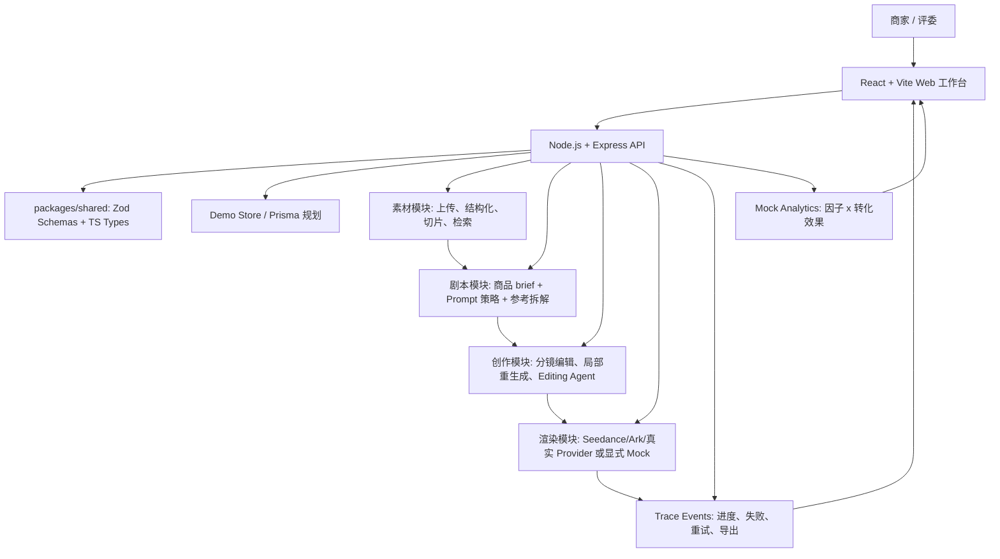

# ShopClip AI 作品提交文档（评审版）

> 提交前请先替换所有 `【待补充】` 字段。本文档可直接复制到飞书文档或提交系统。不要在提交文档、README、截图或演示视频中暴露任何 API Key、Endpoint 密钥、服务器私钥或 `.env` 内容。

## 提交材料使用说明

- 评审快速入口：优先提供在线 Demo、演示视频、源代码仓库和本文档。
- 推荐体验路径：打开 `https://shopclip.site/#project`，按“创建项目 -> 上传素材 -> 生成剧本分镜 -> 编辑分镜 -> 渲染 trace -> 预览导出 -> 查看数据看板”体验。
- 仍需人工补齐：团队名称、成员学校/专业/角色、演示视频、产品截图和最终参赛系统要求的字段。
- 安全边界：提交材料只描述配置项名称和能力边界，不写入任何真实密钥、服务器私钥、`.env` 内容或内部账号凭证。

## 1. 基础信息

| 字段 | 内容 |
| --- | --- |
| 项目名称 | ShopClip AI |
| 参赛课题 | 电商场景 AIGC 带货视频生成系统 |
| 提效形式 | 统一飞书文档 / 在线 Demo / 源代码仓库 |
| 团队名称 | 【待补充】 |
| 团队成员 | 金宇辰【待补充学校、专业、角色】 |
| 分工说明 | 【待补充】如单人完成，可写：产品设计、前端工作台、后端 API、AI provider 对接、素材结构化、智能剪辑、部署与验证均由金宇辰负责。 |
| 在线 Demo | https://shopclip.site |
| Demo 入口建议 | https://shopclip.site/#project |
| API 健康检查 | https://shopclip.site/health |
| 演示视频链接 | 【待补充：建议上传 3-8 分钟公开视频链接】 |
| 源代码仓库 | https://github.com/Jankin-Chen123/shopclip-ai |
| 提交分支 / 当前提交 | `main` / 以 GitHub 最新提交为准 |
| README / 运行说明 | `README.md` |

## 2. 一句话核心业务价值

ShopClip AI 帮助 TikTok Shop 等跨境电商商家把商品素材、卖点和创意目标快速转化为可编辑、可追踪、可导出的 AIGC 带货短视频，降低短视频生产门槛，并为后续转化优化沉淀素材、分镜和创意因子的结构化数据基础。

## 3. 项目简介

ShopClip AI 是一个面向商家的 AIGC 带货短视频生成工作台。系统围绕“素材库建设 -> 剧本生成 -> 分镜创作 -> 视频渲染 -> 预览导出 -> 效果看板”的完整链路展开，既覆盖课题要求中的 P0 主流程，也实现了多项 P1 进阶能力。

项目不是只展示一次模型调用结果，而是把电商视频创作拆成可复用的工程对象：商品项目、素材资产、素材切片、剧本、分镜、渲染任务、trace 事件、导出产物和 mock 效果指标。评委可以通过在线 Demo 快速体验端到端流程，也可以通过 README、架构图和测试证据复核工程实现。

评审重点建议关注三点：第一，素材结构化、剧本分镜和渲染 trace 之间形成了可追踪的数据链路；第二，分镜级编辑和局部重生成让生成结果可控；第三，真实 provider 与显式 mock 边界清晰，避免把测试 fixture 伪装成真实业务结果。

## 4. 核心功能清单

1. 商品项目与素材入库：支持创建商品视频项目，录入商品 brief，上传商品图片、视频和参考素材，并保存素材元数据。
2. 多颗粒度素材结构化：对素材做商品级、视频级和切片级结构化处理，支持标签、OCR、关键帧、slice 信息和检索上下文。
3. 剧本与分镜生成：基于商品卖点、目标人群、创意风格和参考素材生成带货脚本，并拆解为 15 秒以内的可编辑分镜。
4. 分镜级编辑与局部重生成：支持修改单个分镜的画面描述、字幕、旁白、时长、素材绑定和视觉风格，局部刷新时不需要重做整片。
5. 智能剪辑与生成 trace：提供 Editing Agent 建议、素材召回、TTS/字幕/BGM 设置、失败重试和生成过程 trace，增强长任务可解释性。
6. 预览导出与数据看板：支持预览生成结果、导出成片或演示产物，并通过 mock 数据看板展示创意因子与转化效果的关系。

## 5. 端到端使用流程

1. 评委打开 `https://shopclip.site/#project`，进入 ShopClip AI 项目工作台。
2. 在项目入口创建或选择一个商品视频项目，录入商品名称、卖点、目标人群、使用场景和创意风格。
3. 上传商品主图、商品视频或参考素材，系统将素材转为可被剧本和创作模块消费的结构化资产。
4. 点击生成脚本，系统根据商品 brief、素材信息和创意策略生成带货剧本与分镜。
5. 进入 Studio 后，用户可以逐镜查看和编辑画面描述、字幕、旁白、时长、素材绑定和风格提示。
6. 用户可使用素材检索和 Editing Agent 建议快速替换镜头素材或优化分镜表达。
7. 在交付区设置画幅、字幕、TTS、BGM 等参数后启动渲染，页面展示任务进度、trace 事件、失败原因和重试入口。
8. 渲染完成后，用户可以在线预览生成结果、导出视频产物，并进入 Analytics dashboard 查看 mock 转化指标。

## 6. 系统架构图



## 7. 核心技术栈

| 层级 | 技术与说明 |
| --- | --- |
| 前端 | React 19、Vite、TypeScript、lucide-react，构建多面板创作工作台、分镜编辑器、素材检索、预览导出和数据看板 |
| 后端 | Node.js、Express、TypeScript，提供项目、素材、剧本、分镜、渲染、导出、trace 和 dashboard API |
| 契约 | `packages/shared` 中使用 Zod schema 与共享类型，降低前后端字段漂移风险 |
| 数据 | 当前 Demo 使用确定性 in-memory store；仓库保留 Prisma/PostgreSQL 规划与 schema，便于后续生产持久化 |
| AI / 模型 | 火山方舟兼容 OpenAI 风格接口、Doubao/Seedance 类 provider adapter、视觉理解、剧本生成、参考拆解、图片/视频生成、TTS 扩展位 |
| 媒体处理 | ffprobe/ffmpeg 用于视频元数据探测、关键帧抽取、分镜片段拼接和导出合成 |
| 测试 | Vitest、Playwright，覆盖 API 生命周期、共享契约、核心前端流程和 P0/P1 E2E |
| 部署 | Render Blueprint 配置与当前云服务器部署；线上访问域名为 `https://shopclip.site` |

## 8. 大模型 / AI 能力使用说明

- 剧本生成：将商品标题、卖点、目标人群、创意风格、约束规则和素材上下文组合为结构化 prompt，输出 hook、叙事框架、旁白、字幕和分镜草案。
- 视觉理解：对商品图、商品视频和参考素材做多模态理解，抽取商品主体、类目、视觉卖点、OCR 文本、关键帧和 slice 特征。
- 参考视频拆解：支持把公开视频或自有参考视频转为结构化拆解报告，沉淀 Hook、卖点、镜头语言、风格因子和创意模板。
- 智能剪辑 Agent：基于分镜目标、素材标签和当前编辑状态，给出素材替换、时长调整、字幕优化、镜头顺序等可解释建议。
- 视频生成 / 渲染：通过 Seedance/Ark/真实 provider adapter 或显式 mock fixture 执行分镜渲染；真实 provider 未配置时不会静默伪造业务结果，而是给出清晰配置错误或使用明确的测试模式。
- 失败兜底：长任务通过 trace 展示每一步状态；失败时保留项目数据，允许从失败节点重试，避免用户从头开始。

## 9. 关键工程难点与解决方案

### 9.1 长任务进度、失败重试与可解释 trace

视频生成涉及脚本、素材处理、分镜渲染、合成与导出，天然耗时且容易失败。项目将 trace event 作为一等数据，而不是后端日志附属物。前端可以直接展示排队、执行、失败、重试和完成状态；失败任务保留上下文，用户可以重试而不是重建项目。

### 9.2 素材到分镜的多颗粒度数据结构

单张图片或单个视频不能满足带货视频生成的素材需求。项目把素材拆成商品级、视频级和 slice 级结构，记录标签、视觉摘要、OCR 文本、关键帧和检索字段。这样剧本生成、分镜编辑、智能剪辑和参考拆解都能消费同一套结构化资产。

### 9.3 前后端契约一致性与复杂编辑状态

分镜编辑涉及字幕、旁白、时长、素材绑定、视觉 prompt、媒体设置、未保存状态和局部重生成。项目把核心 API response 和 request 放入共享 Zod schema，通过 TypeScript 类型在前后端复用，并用 Vitest/Playwright 覆盖关键路径，降低字段变更造成的联调风险。

### 9.4 真实 provider 与演示稳定性的边界

课题既要求体现真实 AI 能力，也要求评审可访问、可复核。项目把真实 provider、显式 mock fixture 和配置错误清晰分开：业务模式下缺少模型配置会报错，自动化测试和演示 fixture 才使用显式 mock。这样既避免把假结果伪装成真实生成，也保证演示链路可稳定复现。

## 10. 部署与访问说明

### 在线体验

- Web：`https://shopclip.site`
- 推荐入口：`https://shopclip.site/#project`
- API 健康检查：`https://shopclip.site/health`

评委可按“项目入口 -> 商品 brief -> 素材入库 -> 剧本/分镜 -> Studio 编辑 -> 渲染 trace -> 预览导出 -> Analytics dashboard”的路径体验核心链路。当前线上版本不要求评委登录。

### 本地运行

```bash
corepack enable
corepack pnpm install
cp .env.example .env
corepack pnpm dev
```

PowerShell 环境可用：

```powershell
Copy-Item .env.example .env
corepack pnpm dev
```

默认地址：

- Web：`http://localhost:5173/#project`
- API health：`http://localhost:4000/health`

### 关键环境变量

真实业务模式下，模型、对象存储、视频生成和 TTS 密钥均只放在服务端环境变量中，前端只读取公开的 `VITE_API_URL`。提交材料不得包含 `.env`、API Key 或云资源密钥。

## 11. 项目完成度

当前项目状态：已部署可体验 Demo，P0/P1 主体能力已完成，并保留向生产级能力扩展的接口。

| 范围 | 完成情况 |
| --- | --- |
| P0 商品素材上传 | 已完成 |
| P0 剧本生成 | 已完成 |
| P0 基础分镜 | 已完成 |
| P0 一键成片 / 渲染任务 | 已完成 |
| P0 任务进度 | 已完成，包含 trace |
| P0 预览导出 | 已完成 |
| P1 素材标签 / 检索 | 已完成 |
| P1 智能剪辑 Agent | 已完成 |
| P1 分镜级编辑 | 已完成 |
| P1 TTS / 字幕 / BGM | 已完成配置与演示链路 |
| P1 失败重试 | 已完成 |
| P1 生成过程 trace | 已完成 |
| P1 Mock 数据看板 | 已完成 |
| P2 CI/CD / 可观测性 | 部分完成：部署脚本、健康检查、trace、测试验证已具备；生产级监控仍可继续增强 |
| 生产级持久化 | 待增强：当前 Demo 默认 in-memory，已保留 Prisma/PostgreSQL 路线 |

## 12. 项目亮点 / 创新点

1. 不是单点视频生成，而是围绕“素材 -> 剧本 -> 分镜 -> 渲染 -> 归因”的完整电商内容生产链路建模。
2. 将爆款参考拆解、素材多颗粒度结构化和智能剪辑建议结合，让 AI Agent 参与创意增长，而不是只负责生成一段文本。
3. 通过 trace、失败重试、局部重生成和可编辑 Studio，解决 AIGC 视频长任务黑盒、失败后难恢复、一次性生成不可控的问题。

## 13. README / 运行说明摘要

仓库 README 已包含以下内容：

- 项目简介与当前状态。
- 技术栈、目录结构、启动命令和环境变量。
- Demo 流程和 API 概览。
- 架构图、真实 / mock 边界和安全说明。
- Render 部署说明和验证命令。

建议提交时同时附上 `README.md` 链接，并在飞书文档中保留本提交文档作为评委快速理解入口。

## 14. 接口清单摘要

| Method | Endpoint | 用途 |
| --- | --- | --- |
| `GET` | `/health` | API 健康检查 |
| `POST` | `/api/projects` | 创建项目 |
| `GET` | `/api/projects/:projectId` | 加载项目快照 |
| `POST` | `/api/projects/:projectId/assets` | 添加素材元数据 |
| `POST` | `/api/projects/:projectId/assets/import-external` | 导入外部素材 |
| `POST` | `/api/projects/:projectId/generate-script` | 生成脚本和分镜 |
| `GET` | `/api/assets/search` | 检索素材 |
| `PATCH` | `/api/scenes/:sceneId` | 保存分镜编辑 |
| `POST` | `/api/scenes/:sceneId/regenerate` | 重生成单个分镜 |
| `GET` | `/api/scenes/:sceneId/suggestions` | 获取 Editing Agent 建议 |
| `POST` | `/api/projects/:projectId/render` | 启动渲染 |
| `GET` | `/api/render-tasks/:renderTaskId` | 加载渲染任务和 trace |
| `POST` | `/api/render-tasks/:renderTaskId/retry` | 重试失败渲染 |
| `GET` | `/api/projects/:projectId/export` | 导出预览产物 |
| `GET` | `/api/projects/:projectId/dashboard` | 加载 mock 数据看板 |

## 15. 验证与复核材料

可复核文档与证据：

- 需求文档：`projects/shopclip-ai/00-requirements.md`
- 设计规范：`projects/shopclip-ai/01-design-spec.md`
- 开发计划：`projects/shopclip-ai/02-development-plan.md`
- 最终交接：`projects/shopclip-ai/evidence/final-handoff.md`
- 安全复核：`projects/shopclip-ai/evidence/final-security-review.md`
- 工程审计：`projects/shopclip-ai/evidence/2026-06-08-engineering-audit.md`
- 各 Part 验证证据：`projects/shopclip-ai/evidence/`

常用验证命令：

```bash
corepack pnpm test
corepack pnpm typecheck
corepack pnpm lint
corepack pnpm build
corepack pnpm --filter @shopclip/web test:e2e
```

最近工程记录显示，P0/P1 E2E、API 测试、typecheck、lint、test 和 build 均有通过记录；build 中存在 Vite 大 chunk 提示，这是体积优化提示，不影响当前 Demo 可运行性。

## 16. 安全与合规说明

- 提交材料不包含任何 API Key、模型密钥、服务器私钥或真实商家敏感数据。
- 模型凭证只通过服务端环境变量配置，浏览器不会直接调用模型 provider。
- 公开视频或第三方素材用于分析时只保存结构化拆解结果，不复刻、不混剪原视频。
- Demo 支持自有素材、公开可用素材或明确的测试 fixture；生产化前需接入更完整的版权、内容审核和数据持久化机制。
- Express API 已配置基础安全响应头、显式 CORS origin、JSON body size 限制，并禁用 `X-Powered-By` 指纹。

## 17. 提交前补充材料清单

提交前建议继续补齐：

- 【待补充】团队名称、成员学校、专业、角色和具体分工。
- 【待补充】3-8 分钟演示视频链接，建议覆盖创建项目、上传素材、生成脚本、编辑分镜、渲染 trace、预览导出和看板。
- 【待补充】产品关键截图，可从 `projects/shopclip-ai/evidence/` 或线上 Demo 重新截取。
- 【待补充】1-2 条端到端生成的视频作品链接或下载地址。
- 【待补充】如评委需要登录或特殊路径，补充体验账号或录屏替代方案。

## 18. 提交页字段速填版

| 字段 | 建议填写 |
| --- | --- |
| 项目名称 / 课题 | ShopClip AI / 电商场景 AIGC 带货视频生成系统 |
| 团队名称与成员名单 | 【待补充】 |
| 分工说明 | 【待补充】 |
| 一句话价值 | 帮助跨境电商商家把商品素材和卖点快速生成可编辑、可追踪、可导出的 AIGC 带货短视频。 |
| 核心功能 | 素材上传与结构化、剧本/分镜生成、分镜级编辑、智能剪辑 Agent、渲染 trace、预览导出、mock 效果看板 |
| 端到端流程 | 打开 Demo -> 创建项目 -> 上传素材 -> 生成剧本分镜 -> 编辑分镜 -> 启动渲染 -> 查看 trace -> 预览导出 -> 查看数据看板 |
| 在线 Demo | https://shopclip.site |
| 演示视频 | 【待补充】 |
| 源代码仓库 | https://github.com/Jankin-Chen123/shopclip-ai |
| README / 运行说明 | 仓库根目录 `README.md` |
| 系统架构图 | 使用本文第 6 节 Mermaid 架构图 |
| 核心技术栈 | React、Vite、TypeScript、Node.js、Express、Zod、Vitest、Playwright、ffmpeg、火山方舟/Seedance provider adapter |
| AI 能力说明 | 剧本生成、视觉理解、参考拆解、智能剪辑建议、视频渲染、TTS/字幕/BGM 扩展 |
| 完成度 | 已部署可体验 Demo，P0/P1 主体能力完成，生产级持久化和监控可继续增强 |
| 项目亮点 | 完整电商视频生产链路、多颗粒度素材结构化、分镜级可控编辑与 trace 可解释长任务 |
